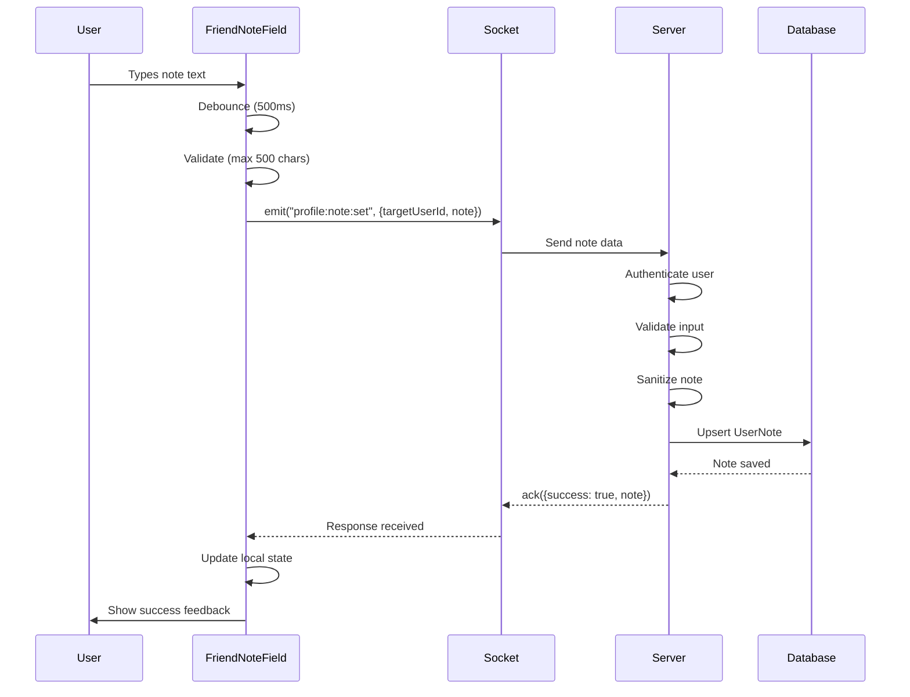
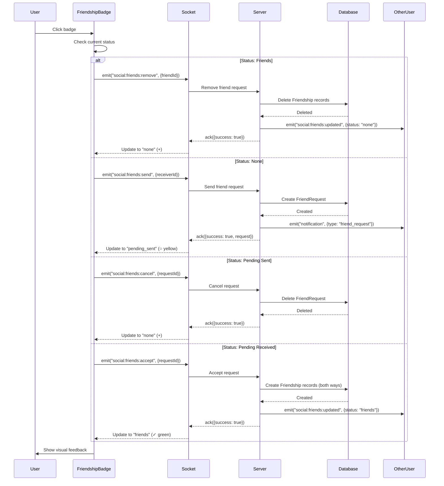
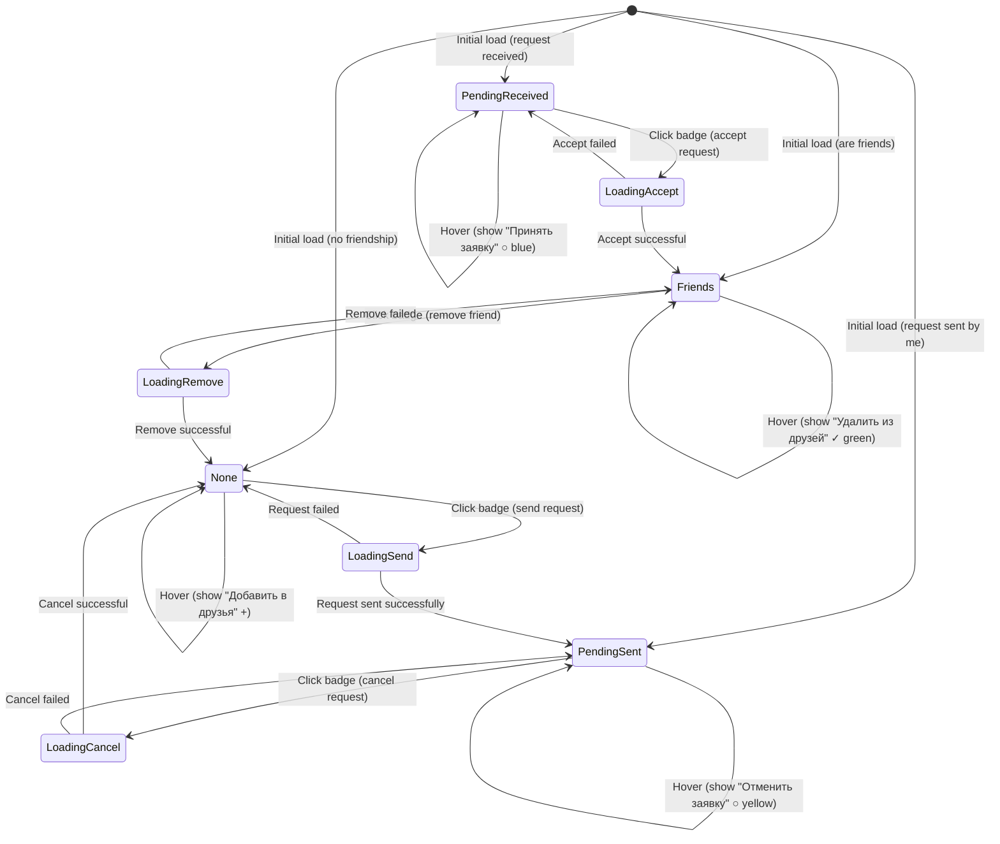
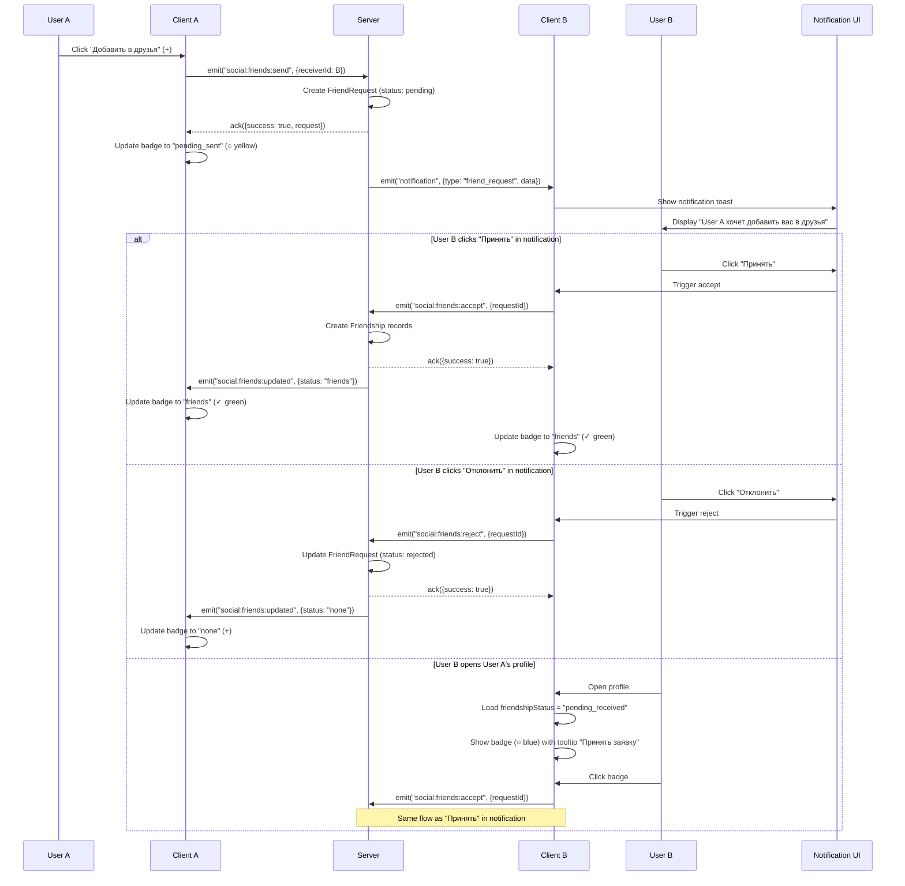
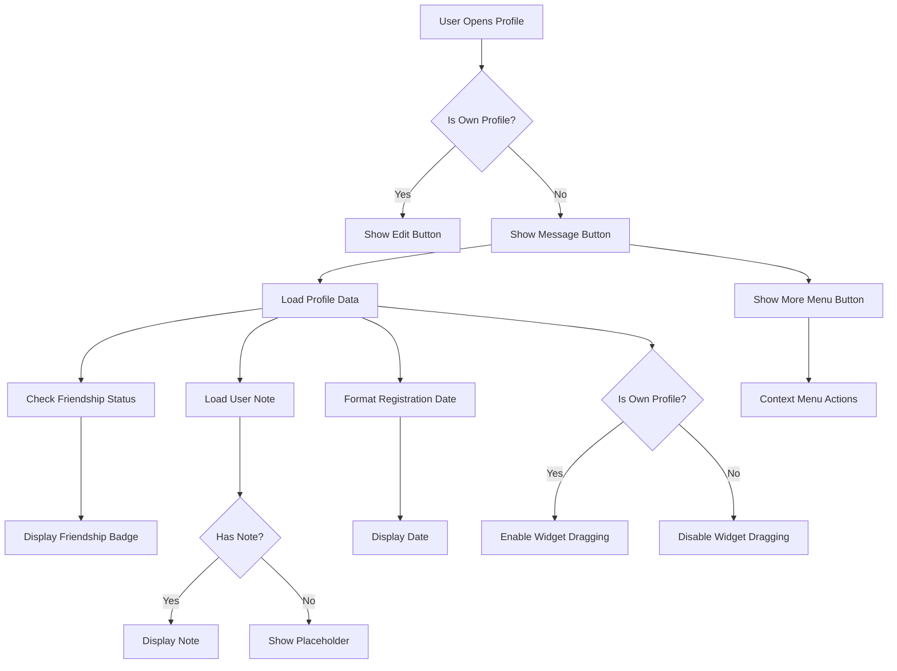

# Design Document: Player Profile Improvements

## ⚠️ IMPORTANT: Scope Clarification

**THIS SPEC FOCUSES EXCLUSIVELY ON FullProfileModal (полная модалка с вкладками).**

**NOT MODIFIED:**
- MiniProfile (Discord-style popup)
- PlayerProfileModal (модалка из игровой комнаты)

All changes described in this document apply ONLY to FullProfileModal and its child components (FullProfileSidebar, BoardTab, etc.).

---

## Overview

Данный документ описывает техническое решение для улучшения системы профилей игроков в приложении PartyChaos. Цель — привести UX профиля к стандартам Discord, исправить существующие баги и добавить недостающий функционал.

### Scope

Проект включает следующие улучшения **ТОЛЬКО для FullProfileModal**:

1. **Кнопка "Написать"** — добавление кнопки для открытия личного чата под никнеймом
2. **Расположение кнопок** — горизонтальный ряд: "Написать" → FriendshipBadge → "Ещё" (три точки)
3. **Контекстное меню "Ещё"** — реорганизация действий в выпадающее меню
4. **Система заметок** — улучшение существующей функциональности заметок о друзьях (Discord-style: без бордеров по умолчанию)
5. **Дата регистрации** — отображение даты вступления пользователя под разделом "Участник с"
6. **Бейдж дружбы (3 состояния)** — визуальный индикатор статуса дружбы с быстрым управлением:
   - Друг (✓ зеленый)
   - Не друг (+ серый)
   - Заявка отправлена (○ желтый)
   - Заявка получена (○ синий) - при клике "Принять заявку"
7. **Уведомления о заявках** — когда отправляется заявка, получатель видит уведомление с кнопками "Принять"/"Отклонить"
8. **Защита виджетов** — отключение перетаскивания в чужих профилях (BoardTab)
9. **Защита изображений** — предотвращение выделения изображений

### Goals

- Улучшить UX профилей до уровня Discord
- Исправить баги с заметками и виджетами
- Обеспечить консистентность интерфейса
- Сохранить производительность и отзывчивость UI

### Non-Goals

- Редизайн всей системы профилей
- Изменение структуры БД (используем существующую схему)
- Добавление новых типов виджетов
- Изменение системы достижений


## Architecture

### System Context

PartyChaos использует следующий технологический стек:

- **Frontend**: React 18 с Hooks, Framer Motion для анимаций
- **Backend**: Node.js с Socket.IO для real-time коммуникации
- **Database**: PostgreSQL с Prisma ORM
- **State Management**: React Context API + локальное состояние компонентов

### High-Level Architecture

```
┌─────────────────────────────────────────────────────────────┐
│                     Client (React)                          │
│  ┌──────────────┐  ┌──────────────┐  ┌──────────────┐     │
│  │ MiniProfile  │  │FullProfile   │  │PlayerProfile │     │
│  │   Modal      │  │   Modal      │  │   Modal      │     │
│  └──────┬───────┘  └──────┬───────┘  └──────┬───────┘     │
│         │                  │                  │              │
│         └──────────────────┴──────────────────┘              │
│                            │                                 │
│                   ┌────────▼────────┐                       │
│                   │  Socket.IO      │                       │
│                   │  Client         │                       │
│                   └────────┬────────┘                       │
└────────────────────────────┼──────────────────────────────┘
                             │
                    ┌────────▼────────┐
                    │  Socket.IO      │
                    │  Server         │
                    └────────┬────────┘
                             │
         ┌───────────────────┼───────────────────┐
         │                   │                   │
    ┌────▼─────┐      ┌─────▼──────┐     ┌─────▼──────┐
    │ Profile  │      │  Friends   │     │   Chat     │
    │ Handlers │      │  Handlers  │     │  Handlers  │
    └────┬─────┘      └─────┬──────┘     └─────┬──────┘
         │                  │                   │
         └──────────────────┴───────────────────┘
                            │
                     ┌──────▼──────┐
                     │   Prisma    │
                     │     ORM     │
                     └──────┬──────┘
                            │
                     ┌──────▼──────┐
                     │ PostgreSQL  │
                     │  Database   │
                     └─────────────┘
```

### Component Architecture


#### Profile Components Hierarchy

```
ProfileSystem
├── MiniProfile (Discord-style popup)
│   ├── ProfileHeader
│   │   ├── AvatarFrame
│   │   └── StyledNickname
│   ├── ProfileActions
│   │   └── (No changes - not affected by this spec)
│   └── MiniProfileMoreMenu (Popover)
│       └── (No changes - not affected by this spec)
│
└── FullProfileModal (Full modal with tabs) ⭐ MAIN FOCUS
    ├── FullProfileSidebar
    │   ├── AvatarFrame
    │   ├── StyledNickname
    │   ├── ProfileActionButtons (NEW - horizontal row)
    │   │   ├── MessageButton ("Написать")
    │   │   ├── FriendshipBadge (3 states: Friend ✓ / Not Friend + / Pending ○)
    │   │   └── MoreMenuButton ("Ещё" - три точки)
    │   ├── FriendNoteField (Discord-style, borderless by default)
    │   └── RegistrationDate (under "Участник с" section)
    └── FullProfileTabs
        ├── BoardTab (with widgets - drag protection enabled)
        ├── ActivityTab
        └── WishlistTab
```

**IMPORTANT**: MiniProfile and PlayerProfileModal are NOT modified in this spec.

### Data Flow

#### Friend Note Update Flow

```
User Input (textarea)
    │
    ├─> Debounce (500ms)
    │
    ├─> Validate (max 500 chars)
    │
    ├─> Socket.emit("profile:note:set")
    │
    └─> Server Handler
            │
            ├─> Authenticate user
            │
            ├─> Sanitize input
            │
            ├─> Prisma upsert (UserNote)
            │
            ├─> ack({ success: true })
            │
            └─> Client updates local state
```

#### Friendship Toggle Flow (Enhanced with 3 States)

```
User clicks FriendshipBadge
    │
    ├─> Check current status
    │   ├─> "friends" (✓)
    │   ├─> "none" (+)
    │   └─> "pending" (○)
    │
    ├─> Determine action
    │   ├─> If "friends": "social:friends:remove"
    │   ├─> If "none": "social:friends:send"
    │   └─> If "pending" (sent by me): "social:friends:cancel"
    │       └─> If "pending" (received): "social:friends:accept"
    │
    ├─> Socket.emit(event, { friendId })
    │
    └─> Server Handler
            │
            ├─> Validate relationship
            │
            ├─> Update database
            │
            ├─> Broadcast to both users
            │   ├─> Sender: update badge state
            │   └─> Receiver: send notification
            │
            ├─> ack({ success: true })
            │
            └─> Client updates badge state
```

#### Friend Request Notification Flow (NEW)

```
User A sends friend request
    │
    ├─> Socket.emit("social:friends:send", { friendId: userB })
    │
    └─> Server Handler
            │
            ├─> Create FriendRequest (status: "pending")
            │
            ├─> Emit to User B: "notification"
            │   └─> type: "friend_request"
            │       └─> data: { senderId, senderNickname, senderAvatarUrl }
            │
            └─> User B sees notification
                    │
                    ├─> Click "Принять"
                    │   └─> Socket.emit("social:friends:accept")
                    │       └─> Create Friendship records
                    │           └─> Update both badges to "friends" (✓)
                    │
                    └─> Click "Отклонить"
                        └─> Socket.emit("social:friends:reject")
                            └─> Delete FriendRequest
                                └─> Update sender badge to "none" (+)

User B opens User A's profile while request is pending
    │
    └─> FriendshipBadge shows "pending" (○)
            │
            └─> Tooltip: "Принять заявку в друзья"
                    │
                    └─> Click badge
                            └─> Socket.emit("social:friends:accept")
```


## Components and Interfaces

### Client Components

#### 1. MessageButton Component

**Purpose**: Консистентная кнопка для открытия личного чата

**Props**:
```typescript
interface MessageButtonProps {
  targetUserId: string;
  onOpenChat?: (userId: string) => void;
  variant?: 'primary' | 'secondary';
  className?: string;
}
```

**Behavior**:
- Использует существующий компонент `Button` из `client/src/components/ui/Button.jsx`
- При клике вызывает `onOpenChat` с `targetUserId`
- Открывает `MessengerModal` или `ChatWindow` с выбранным пользователем
- Стиль идентичен кнопке "Редактировать профиль"

**Integration Points**:
- `MiniProfile.jsx`
- `FullProfileModal.jsx`
- `PlayerProfileModal.jsx`

---

#### 2. FriendshipBadge Component

**Purpose**: Визуальный индикатор статуса дружбы с быстрым управлением (3 состояния)

**Props**:
```typescript
interface FriendshipBadgeProps {
  targetUserId: string;
  friendshipStatus: 'friends' | 'none' | 'pending_sent' | 'pending_received';
  onToggleFriend: (userId: string, currentStatus: FriendshipStatus) => void;
  socket: Socket;
  className?: string;
}
```

**State**:
```typescript
const [friendshipStatus, setFriendshipStatus] = useState<FriendshipStatus>(initialStatus);
const [isLoading, setIsLoading] = useState<boolean>(false);
const [showTooltip, setShowTooltip] = useState<boolean>(false);
```

**Behavior**:
- Отображает иконку в зависимости от статуса:
  - **"friends"**: галочка ✓ (зеленый)
  - **"none"**: плюс + (серый)
  - **"pending_sent"**: кружок ○ (желтый) - заявка отправлена мной
  - **"pending_received"**: кружок ○ (синий) - заявка получена от другого пользователя
- При hover показывает tooltip с текстом действия:
  - **"friends"**: "Удалить из друзей"
  - **"none"**: "Добавить в друзья"
  - **"pending_sent"**: "Отменить заявку"
  - **"pending_received"**: "Принять заявку в друзья"
- При клике отправляет соответствующее Socket.IO событие
- Обновляет состояние после успешного ответа
- Показывает loader во время операции

**Socket Events**:
- `social:friends:send` — отправить заявку (when status = "none")
- `social:friends:remove` — удалить из друзей (when status = "friends")
- `social:friends:cancel` — отменить заявку (when status = "pending_sent")
- `social:friends:accept` — принять заявку (when status = "pending_received")

**Integration Points**:
- `FullProfileModal.jsx` → `FullProfileSidebar.jsx` (ONLY)
- NOT in MiniProfile or PlayerProfileModal

---

#### 3. FriendNoteField Component

**Purpose**: Поле для создания и редактирования заметок о друзьях (Discord-style)

**Props**:
```typescript
interface FriendNoteFieldProps {
  targetUserId: string;
  initialNote: string;
  socket: Socket;
  onNoteUpdate?: (note: string) => void;
}
```

**State**:
```typescript
const [noteText, setNoteText] = useState<string>(initialNote);
const [isEditing, setIsEditing] = useState<boolean>(false);
const [isSaving, setIsSaving] = useState<boolean>(false);
const [isFocused, setIsFocused] = useState<boolean>(false);
```

**Behavior**:
- Отображает placeholder "Добавить заметку" если заметка пустая
- При клике переходит в режим редактирования
- Использует debounce (500ms) для автосохранения
- Показывает текст "видна только вам" курсивом
- Максимальная длина: 500 символов
- Показывает счетчик символов при редактировании
- **Discord-style**: без бордеров по умолчанию, бордер появляется только при hover/focus

**CSS Styling (Discord-like)**:
```css
.friend-note-field {
  border: none;
  background: transparent;
  transition: all 0.2s ease;
}

.friend-note-field:hover,
.friend-note-field:focus {
  border: 1px solid var(--border-color);
  background: var(--input-bg);
}
```

**Socket Events**:
- `profile:note:set` — сохранить заметку

**Integration Points**:
- `FullProfileModal.jsx` → `FullProfileSidebar.jsx` (ONLY)

---

#### 4. RegistrationDate Component

**Purpose**: Отображение даты регистрации пользователя

**Props**:
```typescript
interface RegistrationDateProps {
  createdAt: string | Date;
  className?: string;
}
```

**Behavior**:
- Форматирует дату в формат "Участник с DD MMM YYYY г."
- Использует русские сокращения месяцев
- Отображается в `FullProfileSidebar` под разделом "Участник с"

**Date Formatting**:
```javascript
const monthsRu = [
  'янв.', 'февр.', 'мар.', 'апр.', 'мая', 'июня',
  'июля', 'авг.', 'сент.', 'окт.', 'нояб.', 'дек.'
];

function formatRegistrationDate(date) {
  const d = new Date(date);
  const day = d.getDate();
  const month = monthsRu[d.getMonth()];
  const year = d.getFullYear();
  return `Участник с ${day} ${month} ${year} г.`;
}
```

**Integration Points**:
- `FullProfileModal.jsx` → `FullProfileSidebar.jsx` (ONLY)

---

#### 5. FullProfileMoreMenu Component (Enhanced)

**Purpose**: Контекстное меню с дополнительными действиями в FullProfileModal

**Props**:
```typescript
interface FullProfileMoreMenuProps {
  isOpen: boolean;
  onClose: () => void;
  position: { x: number; y: number };
  targetUserId: string;
  profile: UserProfile;
  socket: Socket;
  canInviteToClan?: boolean;
}
```

**Menu Items**:
```typescript
interface MenuItem {
  label: string;
  icon: ReactNode;
  action: () => void;
  variant?: 'default' | 'danger';
  condition?: boolean;
}
```

**Behavior**:
- Открывается как popover/dropdown при клике на кнопку "Ещё" (три точки)
- Закрывается при клике вне меню или после выбора действия
- Отображает текущее состояние (например, "Разблокировать" если заблокирован)
- Использует Framer Motion для анимации появления/исчезновения

**Actions**:
- Игнорировать/Разигнорировать
- Заблокировать/Разблокировать
- Пожаловаться
- Пригласить в клан (условно)

**Socket Events**:
- `social:user:ignore`
- `social:user:unignore`
- `social:user:block`
- `social:user:unblock`
- `social:profile:report`
- `social:clan:invite`

**Integration Points**:
- `FullProfileModal.jsx` → `FullProfileSidebar.jsx` (ONLY)
- NOT in MiniProfile or PlayerProfileModal


### Server Handlers

#### Profile Handlers (server/src/social/profile.js)

Существующие обработчики, которые будут использоваться:

**1. profile:note:set** (уже реализован!)
```javascript
socket.on("profile:note:set", async ({ targetUserId, note }, ack) => {
  try {
    const userId = socket.user.id;
    const result = await setUserNote(userId, targetUserId, note);
    
    if (typeof ack === "function") {
      ack({ success: true, note: result.content });
    }
  } catch (error) {
    if (typeof ack === "function") {
      ack({ success: false, error: error.message });
    }
  }
});
```

**2. profile:get** (существующий)
```javascript
socket.on("profile:get", async ({ userId }, ack) => {
  try {
    const currentUserId = socket.user?.id;
    const profile = await getFullProfile(userId, currentUserId);
    
    if (typeof ack === "function") {
      ack({ success: true, profile });
    }
  } catch (error) {
    if (typeof ack === "function") {
      ack({ success: false, error: error.message });
    }
  }
});
```

#### Friends Handlers (server/src/social/friends.js)

Существующие обработчики из документации:

**1. social:friends:send**
```javascript
socket.on("social:friends:send", async ({ receiverId }, ack) => {
  try {
    const senderId = socket.user.id;
    
    // Проверка блокировки
    const isBlocked = await checkIfBlocked(senderId, receiverId);
    if (isBlocked) {
      return ack({ success: false, error: "Пользователь заблокирован" });
    }
    
    // Проверка существующей дружбы
    const existingFriendship = await prisma.friendship.findFirst({
      where: {
        OR: [
          { userId: senderId, friendId: receiverId },
          { userId: receiverId, friendId: senderId }
        ]
      }
    });
    
    if (existingFriendship) {
      return ack({ success: false, error: "Уже в друзьях" });
    }
    
    // Проверка существующей заявки
    const existingRequest = await prisma.friendRequest.findFirst({
      where: {
        OR: [
          { senderId, receiverId },
          { senderId: receiverId, receiverId: senderId }
        ],
        status: "pending"
      }
    });
    
    if (existingRequest) {
      return ack({ success: false, error: "Заявка уже отправлена" });
    }
    
    // Создание заявки
    const request = await prisma.friendRequest.create({
      data: {
        senderId,
        receiverId,
        status: "pending"
      }
    });
    
    // Уведомление получателя
    io.to(receiverId).emit("notification", {
      type: "friend_request",
      data: {
        senderId,
        senderNickname: socket.user.nickname,
        senderAvatarUrl: socket.user.avatarUrl,
        requestId: request.id
      }
    });
    
    ack({ success: true, request });
  } catch (error) {
    ack({ success: false, error: error.message });
  }
});
```

**2. social:friends:accept** (NEW - для принятия заявки)
```javascript
socket.on("social:friends:accept", async ({ requestId }, ack) => {
  try {
    const userId = socket.user.id;
    
    // Найти заявку
    const request = await prisma.friendRequest.findUnique({
      where: { id: requestId },
      include: {
        sender: true,
        receiver: true
      }
    });
    
    if (!request) {
      return ack({ success: false, error: "Заявка не найдена" });
    }
    
    if (request.receiverId !== userId) {
      return ack({ success: false, error: "Нет прав на принятие заявки" });
    }
    
    if (request.status !== "pending") {
      return ack({ success: false, error: "Заявка уже обработана" });
    }
    
    // Создание дружбы (двусторонняя)
    await prisma.$transaction([
      prisma.friendship.create({
        data: {
          userId: request.senderId,
          friendId: request.receiverId
        }
      }),
      prisma.friendship.create({
        data: {
          userId: request.receiverId,
          friendId: request.senderId
        }
      }),
      prisma.friendRequest.update({
        where: { id: requestId },
        data: { status: "accepted" }
      })
    ]);
    
    // Уведомление обоих пользователей
    io.to(request.senderId).emit("social:friends:updated", {
      friendId: request.receiverId,
      status: "friends"
    });
    io.to(request.receiverId).emit("social:friends:updated", {
      friendId: request.senderId,
      status: "friends"
    });
    
    ack({ success: true });
  } catch (error) {
    ack({ success: false, error: error.message });
  }
});
```

**3. social:friends:reject** (NEW - для отклонения заявки)
```javascript
socket.on("social:friends:reject", async ({ requestId }, ack) => {
  try {
    const userId = socket.user.id;
    
    const request = await prisma.friendRequest.findUnique({
      where: { id: requestId }
    });
    
    if (!request) {
      return ack({ success: false, error: "Заявка не найдена" });
    }
    
    if (request.receiverId !== userId) {
      return ack({ success: false, error: "Нет прав на отклонение заявки" });
    }
    
    // Удаление заявки
    await prisma.friendRequest.update({
      where: { id: requestId },
      data: { status: "rejected" }
    });
    
    // Уведомление отправителя
    io.to(request.senderId).emit("social:friends:updated", {
      friendId: request.receiverId,
      status: "none"
    });
    
    ack({ success: true });
  } catch (error) {
    ack({ success: false, error: error.message });
  }
});
```

**4. social:friends:cancel** (NEW - для отмены отправленной заявки)
```javascript
socket.on("social:friends:cancel", async ({ requestId }, ack) => {
  try {
    const userId = socket.user.id;
    
    const request = await prisma.friendRequest.findUnique({
      where: { id: requestId }
    });
    
    if (!request) {
      return ack({ success: false, error: "Заявка не найдена" });
    }
    
    if (request.senderId !== userId) {
      return ack({ success: false, error: "Нет прав на отмену заявки" });
    }
    
    // Удаление заявки
    await prisma.friendRequest.delete({
      where: { id: requestId }
    });
    
    ack({ success: true });
  } catch (error) {
    ack({ success: false, error: error.message });
  }
});
```

**5. social:friends:remove**
```javascript
socket.on("social:friends:remove", async ({ friendId }, ack) => {
  try {
    const userId = socket.user.id;
    
    // Удаление дружбы (двусторонняя)
    await prisma.friendship.deleteMany({
      where: {
        OR: [
          { userId, friendId },
          { userId: friendId, friendId: userId }
        ]
      }
    });
    
    // Уведомление обоих пользователей
    io.to(userId).emit("social:friends:updated", {
      friendId,
      status: "none"
    });
    io.to(friendId).emit("social:friends:updated", {
      friendId: userId,
      status: "none"
    });
    
    ack({ success: true });
  } catch (error) {
    ack({ success: false, error: error.message });
  }
});
```


## Data Models

### Existing Database Schema

Проект использует существующую схему БД, изменения не требуются.

#### UserNote Model (уже существует!)

```prisma
model UserNote {
  id        String   @id @default(cuid())
  userId    String   // Кто создал заметку
  targetId  String   // О ком заметка
  content   String   // Текст заметки (до 500 символов)
  createdAt DateTime @default(now())
  updatedAt DateTime @updatedAt
  
  user   User @relation("UserNotes", fields: [userId], references: [id], onDelete: Cascade)
  target User @relation("UserNotesAbout", fields: [targetId], references: [id], onDelete: Cascade)
  
  @@unique([userId, targetId])
  @@index([userId])
  @@index([targetId])
}
```

**Constraints**:
- Уникальная пара `(userId, targetId)` — один пользователь может иметь только одну заметку о другом
- Каскадное удаление при удалении пользователя
- Индексы для быстрого поиска

#### User Model (relevant fields)

```prisma
model User {
  id        String   @id @default(cuid())
  nickname  String
  tag       String
  avatarUrl String?
  bio       String?
  createdAt DateTime @default(now())  // Дата регистрации
  
  // Заметки
  userNotes    UserNote[] @relation("UserNotes")      // Заметки, созданные мной
  notesAboutMe UserNote[] @relation("UserNotesAbout") // Заметки обо мне
  
  // Дружба
  friends      Friendship[] @relation("UserFriends")
  friendOf     Friendship[] @relation("FriendOf")
  
  // Блокировка
  blockedUsers BlockedUser[] @relation("BlockedBy")
  blockedBy    BlockedUser[] @relation("Blocked")
}
```

#### Friendship Model

```prisma
model Friendship {
  id        String   @id @default(cuid())
  userId    String
  friendId  String
  createdAt DateTime @default(now())
  
  user   User @relation("UserFriends", fields: [userId], references: [id], onDelete: Cascade)
  friend User @relation("FriendOf", fields: [friendId], references: [id], onDelete: Cascade)
  
  @@unique([userId, friendId])
  @@index([userId])
  @@index([friendId])
}
```

### Client-Side Data Structures

#### ProfileData Interface

```typescript
interface ProfileData {
  id: string;
  nickname: string;
  tag: string;
  avatarUrl: string | null;
  avatarFrameId: string | null;
  bio: string | null;
  level: number;
  onlineStatus: 'online' | 'idle' | 'in_game' | 'offline';
  currentGameType: string | null;
  createdAt: string; // ISO date string
  
  // Социальные данные
  friendshipStatus: 'none' | 'pending_sent' | 'pending_received' | 'friends';
  friendRequestId: string | null; // ID заявки (если есть pending)
  isBlocked: boolean;
  isIgnored: boolean;
  note: string | null; // Заметка текущего пользователя о этом профиле
  
  // Статистика
  stats: {
    gamesPlayed: number;
    gamesWon: number;
    winRate: number;
  };
  
  // Достижения
  achievements: Achievement[];
  
  // Виджеты
  widgets: Widget[];
  
  // Игры
  favoriteGames: string[];
  playingGames: string[];
  wishlistGames: string[];
}
```

#### FriendshipStatus Type

```typescript
type FriendshipStatus = 
  | 'none'              // Не друзья, нет заявок
  | 'pending_sent'      // Заявка отправлена мной
  | 'pending_received'  // Заявка получена от другого пользователя
  | 'friends';          // Друзья
```

#### FriendRequest Model (NEW)

```prisma
model FriendRequest {
  id         String   @id @default(cuid())
  senderId   String
  receiverId String
  status     String   @default("pending") // "pending", "accepted", "rejected"
  createdAt  DateTime @default(now())
  updatedAt  DateTime @updatedAt
  
  sender   User @relation("SentRequests", fields: [senderId], references: [id], onDelete: Cascade)
  receiver User @relation("ReceivedRequests", fields: [receiverId], references: [id], onDelete: Cascade)
  
  @@unique([senderId, receiverId])
  @@index([senderId])
  @@index([receiverId])
  @@index([status])
}
```

**Note**: Эта модель может уже существовать в schema.prisma. Если нет - нужно добавить.


## Correctness Properties

*A property is a characteristic or behavior that should hold true across all valid executions of a system—essentially, a formal statement about what the system should do. Properties serve as the bridge between human-readable specifications and machine-verifiable correctness guarantees.*

### Property Reflection

После анализа acceptance criteria были выявлены следующие группы свойств:

**Группа 1: UI Консистентность**
- Свойства 1.2 (стиль кнопки "Написать") и 7.1-7.3 (CSS user-select) проверяют применение CSS свойств
- Эти свойства можно объединить в одно: "CSS свойства применяются корректно"

**Группа 2: Friendship Badge**
- Свойства 5.3 и 5.5 проверяют поведение при клике на бейдж
- Свойства 5.2 и 5.4 проверяют визуальное отображение
- Можно объединить в два свойства: одно для визуального состояния, одно для поведения

**Группа 3: Заметки**
- Свойства 3.4, 3.5, 3.7, 3.8 проверяют сохранение и синхронизацию
- Свойства 8.1, 8.2, 8.4, 8.5 проверяют парсинг и форматирование
- Свойство 8.4 (round-trip) покрывает 8.1 и 8.2
- Можно объединить в три свойства: round-trip, синхронизация, уникальность

**Группа 4: Контекстное меню**
- Свойства 2.2, 2.5, 2.6, 2.7 проверяют поведение меню
- Можно объединить в два свойства: открытие/закрытие и выполнение действий

**Итоговые свойства после рефлексии:**


### Property 1: Message Button Style Consistency

*For any* profile component (MiniProfile, FullProfileModal, PlayerProfileModal), the "Написать" button SHALL have the same CSS properties (size, padding, font) as the "Редактировать профиль" button in the user's own profile.

**Validates: Requirements 1.2**

---

### Property 2: Message Button Click Behavior

*For any* user profile, when the "Написать" button is clicked, the system SHALL invoke the chat handler with the correct target user ID.

**Validates: Requirements 1.3**

---

### Property 3: Context Menu Toggle Behavior

*For any* profile, when the "Ещё" button is clicked, the context menu SHALL toggle its visibility state (closed → open or open → closed).

**Validates: Requirements 2.2, 2.6**

---

### Property 4: Context Menu Actions Execution

*For any* context menu item, when selected, the system SHALL emit the corresponding Socket.IO event with the correct payload and close the menu.

**Validates: Requirements 2.5, 2.6**

---

### Property 5: Context Menu Dynamic State

*For any* user relationship state (blocked/unblocked, ignored/unignored), the context menu SHALL display the appropriate action label reflecting the current state.

**Validates: Requirements 2.7**

---

### Property 6: Friend Note Round-Trip Preservation

*For any* valid note (length ≤ 500 characters), saving then loading the note SHALL produce an equivalent result, preserving special characters, line breaks, and formatting.

**Validates: Requirements 8.1, 8.2, 8.4, 8.5**

---

### Property 7: Friend Note Synchronization

*For any* note update, after successful save via Socket.IO, all connected clients for the same user SHALL receive the updated note without page reload.

**Validates: Requirements 3.4, 3.5, 3.7**

---

### Property 8: Friend Note Uniqueness

*For any* user pair (userId, targetId), the system SHALL prevent creation of duplicate notes and SHALL use upsert operation to ensure only one note exists.

**Validates: Requirements 3.8**

---

### Property 9: Registration Date Formatting

*For any* valid date, the registration date formatter SHALL produce output in the format "Участник с DD MMM YYYY г." using Russian month abbreviations.

**Validates: Requirements 4.1, 4.2**

---

### Property 10: Friendship Badge Visibility

*For any* profile view, the friendship badge SHALL be visible if and only if the profile is not the current user's own profile.

**Validates: Requirements 5.1**

---

### Property 11: Friendship Badge State Reflection

*For any* friendship status change (add/remove friend, send/accept/reject/cancel request), the badge SHALL update its visual state (icon, color, and tooltip) without page reload, correctly reflecting one of four states: friends (✓), none (+), pending_sent (○ yellow), or pending_received (○ blue).

**Validates: Requirements 5.2, 5.3, 5.4, 5.5, 5.6**

---

### Property 12: Widget Drag Restriction

*For any* profile view, widgets SHALL be draggable if and only if the profile belongs to the current user (isSelf === true).

**Validates: Requirements 6.1, 6.2, 6.4**

---

### Property 13: Image Selection Prevention

*For all* images, avatars, and avatar frames in profile components, the CSS property user-select SHALL be set to none, preventing text selection highlighting.

**Validates: Requirements 7.1, 7.2, 7.3**


## Error Handling

### Client-Side Error Handling

#### Socket.IO Connection Errors

```javascript
// Обработка потери соединения
socket.on("disconnect", () => {
  addNotification({
    type: "warning",
    message: "Соединение потеряно. Переподключение..."
  });
});

socket.on("connect", () => {
  addNotification({
    type: "success",
    message: "Соединение восстановлено"
  });
  
  // Повторная загрузка данных профиля
  if (currentProfileId) {
    loadProfile(currentProfileId);
  }
});
```

#### Socket Event Errors

```javascript
// Обработка ошибок в acknowledgements
socket.emit("profile:note:set", { targetUserId, note }, (response) => {
  if (!response.success) {
    addNotification({
      type: "error",
      message: response.error || "Не удалось сохранить заметку"
    });
    
    // Откат локального состояния
    setNoteText(previousNote);
  }
});
```

#### Validation Errors

```javascript
// Валидация длины заметки
const MAX_NOTE_LENGTH = 500;

function validateNote(note) {
  if (note.length > MAX_NOTE_LENGTH) {
    addNotification({
      type: "error",
      message: `Заметка не может быть длиннее ${MAX_NOTE_LENGTH} символов`
    });
    return false;
  }
  return true;
}
```

#### Network Timeout Handling

```javascript
// Таймаут для Socket.IO операций
function emitWithTimeout(event, payload, timeout = 5000) {
  return new Promise((resolve, reject) => {
    const timer = setTimeout(() => {
      reject(new Error("Превышено время ожидания"));
    }, timeout);
    
    socket.emit(event, payload, (response) => {
      clearTimeout(timer);
      resolve(response);
    });
  });
}

// Использование
try {
  const response = await emitWithTimeout("profile:note:set", { targetUserId, note });
  if (!response.success) {
    throw new Error(response.error);
  }
} catch (error) {
  addNotification({
    type: "error",
    message: "Не удалось сохранить заметку. Попробуйте позже."
  });
}
```

### Server-Side Error Handling

#### Input Validation

```javascript
// Валидация входных данных
function validateNoteInput(userId, targetUserId, note) {
  if (!userId || !targetUserId) {
    throw new Error("Отсутствуют обязательные параметры");
  }
  
  if (userId === targetUserId) {
    throw new Error("Нельзя создать заметку о самом себе");
  }
  
  if (typeof note !== "string") {
    throw new Error("Заметка должна быть строкой");
  }
  
  if (note.length > 500) {
    throw new Error("Заметка не может быть длиннее 500 символов");
  }
}
```

#### Database Error Handling

```javascript
// Обработка ошибок БД с транзакциями
async function setUserNote(userId, targetUserId, note) {
  try {
    validateNoteInput(userId, targetUserId, note);
    
    const result = await prisma.$transaction(async (tx) => {
      // Проверка существования пользователей
      const [user, target] = await Promise.all([
        tx.user.findUnique({ where: { id: userId } }),
        tx.user.findUnique({ where: { id: targetUserId } })
      ]);
      
      if (!user || !target) {
        throw new Error("Пользователь не найден");
      }
      
      // Upsert заметки
      const userNote = await tx.userNote.upsert({
        where: {
          userId_targetId: {
            userId,
            targetId: targetUserId
          }
        },
        update: {
          content: note,
          updatedAt: new Date()
        },
        create: {
          userId,
          targetId: targetUserId,
          content: note
        }
      });
      
      return userNote;
    });
    
    return result;
  } catch (error) {
    console.error("Error setting user note:", error);
    
    // Специфичные ошибки
    if (error.code === "P2002") {
      throw new Error("Заметка уже существует");
    }
    
    if (error.code === "P2025") {
      throw new Error("Пользователь не найден");
    }
    
    throw error;
  }
}
```

#### Rate Limiting

```javascript
// Ограничение частоты запросов
const rateLimiter = new Map();

function checkRateLimit(userId, action, limit = 10, window = 60000) {
  const key = `${userId}:${action}`;
  const now = Date.now();
  
  if (!rateLimiter.has(key)) {
    rateLimiter.set(key, []);
  }
  
  const requests = rateLimiter.get(key);
  const recentRequests = requests.filter(time => now - time < window);
  
  if (recentRequests.length >= limit) {
    throw new Error("Слишком много запросов. Попробуйте позже.");
  }
  
  recentRequests.push(now);
  rateLimiter.set(key, recentRequests);
}

// Использование в обработчике
socket.on("profile:note:set", async ({ targetUserId, note }, ack) => {
  try {
    checkRateLimit(socket.user.id, "note:set", 10, 60000);
    
    const result = await setUserNote(socket.user.id, targetUserId, note);
    
    if (typeof ack === "function") {
      ack({ success: true, note: result.content });
    }
  } catch (error) {
    if (typeof ack === "function") {
      ack({ success: false, error: error.message });
    }
  }
});
```

### Error Recovery Strategies

#### Optimistic Updates with Rollback

```javascript
// Оптимистичное обновление с откатом при ошибке
function useOptimisticNote(initialNote) {
  const [note, setNote] = useState(initialNote);
  const [savedNote, setSavedNote] = useState(initialNote);
  
  const updateNote = async (newNote) => {
    // Оптимистичное обновление
    setNote(newNote);
    
    try {
      const response = await emitWithTimeout("profile:note:set", {
        targetUserId,
        note: newNote
      });
      
      if (response.success) {
        setSavedNote(newNote);
      } else {
        throw new Error(response.error);
      }
    } catch (error) {
      // Откат при ошибке
      setNote(savedNote);
      addNotification({
        type: "error",
        message: "Не удалось сохранить заметку"
      });
    }
  };
  
  return [note, updateNote];
}
```

#### Retry Logic

```javascript
// Повторные попытки с экспоненциальной задержкой
async function retryWithBackoff(fn, maxRetries = 3, baseDelay = 1000) {
  for (let i = 0; i < maxRetries; i++) {
    try {
      return await fn();
    } catch (error) {
      if (i === maxRetries - 1) {
        throw error;
      }
      
      const delay = baseDelay * Math.pow(2, i);
      await new Promise(resolve => setTimeout(resolve, delay));
    }
  }
}

// Использование
try {
  await retryWithBackoff(async () => {
    const response = await emitWithTimeout("profile:note:set", { targetUserId, note });
    if (!response.success) {
      throw new Error(response.error);
    }
  });
} catch (error) {
  addNotification({
    type: "error",
    message: "Не удалось сохранить заметку после нескольких попыток"
  });
}
```


## Testing Strategy

### Dual Testing Approach

Проект использует комбинацию unit-тестов и property-based тестов для обеспечения полного покрытия:

- **Unit tests**: Проверяют конкретные примеры, edge cases и интеграционные точки
- **Property tests**: Проверяют универсальные свойства на большом количестве сгенерированных входных данных

### Property-Based Testing

#### Library Selection

Для JavaScript/React используем **fast-check** — зрелую библиотеку для property-based testing.

```bash
npm install --save-dev fast-check @testing-library/react @testing-library/jest-dom
```

#### Configuration

Каждый property test должен:
- Выполняться минимум 100 итераций
- Иметь комментарий с ссылкой на свойство из design документа
- Использовать тег формата: `Feature: player-profile-improvements, Property {N}: {text}`

#### Property Test Examples

**Property 6: Friend Note Round-Trip**

```javascript
import fc from "fast-check";
import { sanitizeNote, parseNote } from "../utils/noteParser";

describe("Feature: player-profile-improvements, Property 6: Friend Note Round-Trip", () => {
  it("should preserve note content through save-load cycle", () => {
    fc.assert(
      fc.property(
        fc.string({ minLength: 0, maxLength: 500 }),
        (note) => {
          // Round-trip: sanitize → parse → sanitize
          const sanitized = sanitizeNote(note);
          const parsed = parseNote(sanitized);
          const reSanitized = sanitizeNote(parsed);
          
          expect(reSanitized).toBe(sanitized);
        }
      ),
      { numRuns: 100 }
    );
  });
  
  it("should preserve special characters", () => {
    fc.assert(
      fc.property(
        fc.string({ minLength: 1, maxLength: 500 }),
        (note) => {
          const withSpecialChars = note + "<>&\"'";
          const sanitized = sanitizeNote(withSpecialChars);
          const parsed = parseNote(sanitized);
          
          // Специальные символы должны быть экранированы, но восстановлены
          expect(parsed).toContain("<");
          expect(parsed).toContain(">");
          expect(parsed).toContain("&");
        }
      ),
      { numRuns: 100 }
    );
  });
  
  it("should preserve line breaks", () => {
    fc.assert(
      fc.property(
        fc.array(fc.string({ maxLength: 100 }), { minLength: 1, maxLength: 5 }),
        (lines) => {
          const note = lines.join("\n");
          if (note.length > 500) return true; // Skip if too long
          
          const sanitized = sanitizeNote(note);
          const parsed = parseNote(sanitized);
          
          expect(parsed.split("\n").length).toBe(lines.length);
        }
      ),
      { numRuns: 100 }
    );
  });
});
```

**Property 9: Registration Date Formatting**

```javascript
import fc from "fast-check";
import { formatRegistrationDate } from "../utils/dateFormatter";

describe("Feature: player-profile-improvements, Property 9: Registration Date Formatting", () => {
  it("should format any valid date correctly", () => {
    fc.assert(
      fc.property(
        fc.date({ min: new Date("2020-01-01"), max: new Date("2030-12-31") }),
        (date) => {
          const formatted = formatRegistrationDate(date);
          
          // Проверка формата
          expect(formatted).toMatch(/^Участник с \d{1,2} [а-я]+\. \d{4} г\.$/);
          
          // Проверка русских месяцев
          const monthsRu = [
            "янв.", "февр.", "мар.", "апр.", "мая", "июня",
            "июля", "авг.", "сент.", "окт.", "нояб.", "дек."
          ];
          const hasRussianMonth = monthsRu.some(month => formatted.includes(month));
          expect(hasRussianMonth).toBe(true);
        }
      ),
      { numRuns: 100 }
    );
  });
});
```

**Property 11: Friendship Badge State Reflection**

```javascript
import fc from "fast-check";
import { render, fireEvent } from "@testing-library/react";
import FriendshipBadge from "../components/profile/FriendshipBadge";

describe("Feature: player-profile-improvements, Property 11: Friendship Badge State", () => {
  it("should update visual state after friendship change", () => {
    fc.assert(
      fc.property(
        fc.boolean(), // Initial friendship status
        fc.string(), // User ID
        async (initialIsFriend, userId) => {
          const mockSocket = {
            emit: jest.fn((event, payload, ack) => {
              ack({ success: true });
            })
          };
          
          const { container, rerender } = render(
            <FriendshipBadge
              targetUserId={userId}
              isFriend={initialIsFriend}
              socket={mockSocket}
            />
          );
          
          // Клик на бейдж
          const badge = container.querySelector(".friendship-badge");
          fireEvent.click(badge);
          
          // Проверка что Socket.IO событие отправлено
          expect(mockSocket.emit).toHaveBeenCalled();
          
          // Проверка правильного события
          const expectedEvent = initialIsFriend 
            ? "social:friends:remove" 
            : "social:friends:send";
          expect(mockSocket.emit).toHaveBeenCalledWith(
            expectedEvent,
            expect.objectContaining({ friendId: userId }),
            expect.any(Function)
          );
        }
      ),
      { numRuns: 100 }
    );
  });
});
```

**Property 12: Widget Drag Restriction**

```javascript
import fc from "fast-check";
import { render } from "@testing-library/react";
import BoardTab from "../components/profile/BoardTab";

describe("Feature: player-profile-improvements, Property 12: Widget Drag Restriction", () => {
  it("should allow dragging only for own profile", () => {
    fc.assert(
      fc.property(
        fc.boolean(), // isSelf
        fc.array(fc.record({
          id: fc.string(),
          type: fc.constantFrom("achievements", "stats", "games"),
          x: fc.integer({ min: 0, max: 10 }),
          y: fc.integer({ min: 0, max: 10 })
        }), { minLength: 1, maxLength: 10 }),
        (isSelf, widgets) => {
          const { container } = render(
            <BoardTab
              widgets={widgets}
              isSelf={isSelf}
              onWidgetsUpdate={jest.fn()}
            />
          );
          
          const gridLayout = container.querySelector(".react-grid-layout");
          const isDraggable = gridLayout.classList.contains("react-grid-layout--draggable");
          
          expect(isDraggable).toBe(isSelf);
        }
      ),
      { numRuns: 100 }
    );
  });
});
```

### Unit Testing

#### Component Tests

**MessageButton Component**

```javascript
import { render, fireEvent } from "@testing-library/react";
import MessageButton from "../components/profile/MessageButton";

describe("MessageButton", () => {
  it("should render with correct text", () => {
    const { getByText } = render(
      <MessageButton targetUserId="user123" />
    );
    
    expect(getByText("Написать")).toBeInTheDocument();
  });
  
  it("should call onOpenChat with correct userId on click", () => {
    const mockOnOpenChat = jest.fn();
    const { getByText } = render(
      <MessageButton 
        targetUserId="user123" 
        onOpenChat={mockOnOpenChat}
      />
    );
    
    fireEvent.click(getByText("Написать"));
    expect(mockOnOpenChat).toHaveBeenCalledWith("user123");
  });
  
  it("should have same styles as edit profile button", () => {
    const { container: messageContainer } = render(
      <MessageButton targetUserId="user123" />
    );
    
    const { container: editContainer } = render(
      <Button variant="primary">Редактировать профиль</Button>
    );
    
    const messageButton = messageContainer.querySelector("button");
    const editButton = editContainer.querySelector("button");
    
    const messageStyles = window.getComputedStyle(messageButton);
    const editStyles = window.getComputedStyle(editButton);
    
    expect(messageStyles.padding).toBe(editStyles.padding);
    expect(messageStyles.fontSize).toBe(editStyles.fontSize);
    expect(messageStyles.height).toBe(editStyles.height);
  });
});
```

**FriendNoteField Component**

```javascript
import { render, fireEvent, waitFor } from "@testing-library/react";
import FriendNoteField from "../components/profile/FriendNoteField";

describe("FriendNoteField", () => {
  it("should display placeholder when note is empty", () => {
    const { getByPlaceholderText } = render(
      <FriendNoteField 
        targetUserId="user123"
        initialNote=""
        socket={mockSocket}
      />
    );
    
    expect(getByPlaceholderText("Добавить заметку")).toBeInTheDocument();
  });
  
  it("should display existing note", () => {
    const { getByDisplayValue } = render(
      <FriendNoteField 
        targetUserId="user123"
        initialNote="Хороший игрок"
        socket={mockSocket}
      />
    );
    
    expect(getByDisplayValue("Хороший игрок")).toBeInTheDocument();
  });
  
  it("should show character counter when editing", () => {
    const { getByText, getByRole } = render(
      <FriendNoteField 
        targetUserId="user123"
        initialNote=""
        socket={mockSocket}
      />
    );
    
    const textarea = getByRole("textbox");
    fireEvent.focus(textarea);
    fireEvent.change(textarea, { target: { value: "Test" } });
    
    expect(getByText(/4 \/ 500/)).toBeInTheDocument();
  });
  
  it("should prevent input beyond 500 characters", () => {
    const { getByRole } = render(
      <FriendNoteField 
        targetUserId="user123"
        initialNote=""
        socket={mockSocket}
      />
    );
    
    const textarea = getByRole("textbox");
    const longText = "a".repeat(501);
    
    fireEvent.change(textarea, { target: { value: longText } });
    
    expect(textarea.value.length).toBeLessThanOrEqual(500);
  });
  
  it("should debounce save calls", async () => {
    const mockSocket = {
      emit: jest.fn()
    };
    
    const { getByRole } = render(
      <FriendNoteField 
        targetUserId="user123"
        initialNote=""
        socket={mockSocket}
      />
    );
    
    const textarea = getByRole("textbox");
    
    // Быстрый ввод
    fireEvent.change(textarea, { target: { value: "T" } });
    fireEvent.change(textarea, { target: { value: "Te" } });
    fireEvent.change(textarea, { target: { value: "Tes" } });
    fireEvent.change(textarea, { target: { value: "Test" } });
    
    // Socket.emit не должен быть вызван сразу
    expect(mockSocket.emit).not.toHaveBeenCalled();
    
    // Ждем debounce (500ms)
    await waitFor(() => {
      expect(mockSocket.emit).toHaveBeenCalledTimes(1);
    }, { timeout: 600 });
  });
});
```

#### Integration Tests

**Profile Modal Integration**

```javascript
import { render, fireEvent, waitFor } from "@testing-library/react";
import FullProfileModal from "../components/profile/FullProfileModal";
import { SocketContext } from "../context/SocketContext";

describe("FullProfileModal Integration", () => {
  const mockSocket = {
    emit: jest.fn(),
    on: jest.fn(),
    off: jest.fn()
  };
  
  const mockProfile = {
    id: "user123",
    nickname: "TestUser",
    tag: "0001",
    avatarUrl: "/avatar.jpg",
    createdAt: "2024-01-01T00:00:00.000Z",
    isFriend: false,
    note: null
  };
  
  it("should display all profile components correctly", () => {
    const { getByText, getByRole } = render(
      <SocketContext.Provider value={mockSocket}>
        <FullProfileModal 
          isOpen={true}
          profile={mockProfile}
          onClose={jest.fn()}
        />
      </SocketContext.Provider>
    );
    
    // Проверка основных элементов
    expect(getByText("TestUser#0001")).toBeInTheDocument();
    expect(getByText("Написать")).toBeInTheDocument();
    expect(getByText(/Участник с/)).toBeInTheDocument();
    expect(getByRole("button", { name: /friendship-badge/ })).toBeInTheDocument();
  });
  
  it("should handle friendship toggle flow", async () => {
    mockSocket.emit.mockImplementation((event, payload, ack) => {
      ack({ success: true });
    });
    
    const { getByRole, rerender } = render(
      <SocketContext.Provider value={mockSocket}>
        <FullProfileModal 
          isOpen={true}
          profile={mockProfile}
          onClose={jest.fn()}
        />
      </SocketContext.Provider>
    );
    
    const badge = getByRole("button", { name: /friendship-badge/ });
    fireEvent.click(badge);
    
    await waitFor(() => {
      expect(mockSocket.emit).toHaveBeenCalledWith(
        "social:friends:send",
        { friendId: "user123" },
        expect.any(Function)
      );
    });
  });
});
```

### Test Coverage Goals

- **Unit Tests**: 80%+ coverage для компонентов и утилит
- **Property Tests**: 100% coverage для всех correctness properties
- **Integration Tests**: Покрытие основных user flows

### Continuous Integration

```yaml
# .github/workflows/test.yml
name: Tests

on: [push, pull_request]

jobs:
  test:
    runs-on: ubuntu-latest
    
    steps:
      - uses: actions/checkout@v2
      
      - name: Setup Node.js
        uses: actions/setup-node@v2
        with:
          node-version: '18'
      
      - name: Install dependencies
        run: npm ci
      
      - name: Run unit tests
        run: npm test -- --coverage
      
      - name: Run property tests
        run: npm test -- --testNamePattern="Property"
      
      - name: Upload coverage
        uses: codecov/codecov-action@v2
```


## Implementation Plan

### Phase 1: Foundation (Days 1-2)

#### 1.1 Setup and Utilities
- [ ] Create utility functions for date formatting (`formatRegistrationDate`)
- [ ] Create utility functions for note sanitization (`sanitizeNote`, `parseNote`)
- [ ] Add debounce utility for note auto-save
- [ ] Setup fast-check for property-based testing

#### 1.2 Base Components
- [ ] Create `MessageButton` component
- [ ] Create `FriendshipBadge` component
- [ ] Create `RegistrationDate` component
- [ ] Create `FriendNoteField` component

#### 1.3 Unit Tests
- [ ] Write unit tests for utility functions
- [ ] Write unit tests for base components
- [ ] Ensure 80%+ coverage

### Phase 2: Profile Integration (Days 3-4)

#### 2.1 MiniProfile Updates
- [ ] Integrate `MessageButton` into MiniProfile
- [ ] Integrate `FriendshipBadge` into MiniProfile
- [ ] Update `MiniProfileMoreMenu` with new actions
- [ ] Add Framer Motion animations

#### 2.2 FullProfileModal Updates
- [ ] Integrate `MessageButton` into FullProfileModal
- [ ] Integrate `FriendshipBadge` into FullProfileModal
- [ ] Add `FriendNoteField` to FullProfileSidebar
- [ ] Add `RegistrationDate` to FullProfileSidebar
- [ ] Update widget drag restrictions in BoardTab

#### 2.3 PlayerProfileModal Updates
- [ ] Integrate `MessageButton` into PlayerProfileModal
- [ ] Integrate `FriendshipBadge` into PlayerProfileModal
- [ ] Ensure consistency across all profile views

### Phase 3: Functionality (Days 5-6)

#### 3.1 Socket.IO Integration
- [ ] Verify `profile:note:set` handler works correctly
- [ ] Test `social:friends:send` integration
- [ ] Test `social:friends:remove` integration
- [ ] Add error handling and acknowledgements
- [ ] Implement rate limiting

#### 3.2 Context Menu Enhancement
- [ ] Update menu items with dynamic states
- [ ] Add conditional "Пригласить в клан" option
- [ ] Implement all menu actions
- [ ] Add animations and transitions

#### 3.3 CSS Updates
- [ ] Add `user-select: none` to all images
- [ ] Add `user-select: none` to avatars and frames
- [ ] Ensure mobile responsiveness
- [ ] Test across different browsers

### Phase 4: Testing (Days 7-8)

#### 4.1 Property-Based Tests
- [ ] Write property test for note round-trip (Property 6)
- [ ] Write property test for note synchronization (Property 7)
- [ ] Write property test for date formatting (Property 9)
- [ ] Write property test for friendship badge (Property 11)
- [ ] Write property test for widget drag (Property 12)
- [ ] Run all property tests with 100+ iterations

#### 4.2 Integration Tests
- [ ] Test full profile modal integration
- [ ] Test mini profile integration
- [ ] Test player profile modal integration
- [ ] Test Socket.IO event flows
- [ ] Test error scenarios

#### 4.3 Manual Testing
- [ ] Test on Chrome, Firefox, Safari
- [ ] Test on mobile devices (iOS, Android)
- [ ] Test with slow network conditions
- [ ] Test with Socket.IO disconnections
- [ ] Test accessibility (keyboard navigation, screen readers)

### Phase 5: Polish and Documentation (Days 9-10)

#### 5.1 Performance Optimization
- [ ] Optimize re-renders with React.memo
- [ ] Optimize Socket.IO listeners
- [ ] Add loading states and skeletons
- [ ] Test performance with React DevTools Profiler

#### 5.2 Documentation
- [ ] Update component documentation
- [ ] Add JSDoc comments to functions
- [ ] Update technical documentation in `docs/technical/`
- [ ] Create migration guide if needed

#### 5.3 Code Review and Cleanup
- [ ] Remove console.logs and debug code
- [ ] Ensure code follows project conventions
- [ ] Run linter and fix issues
- [ ] Create Pull Request with detailed description

### Rollout Strategy

#### Stage 1: Internal Testing (Day 11)
- Deploy to staging environment
- Test with internal team
- Gather feedback and fix critical issues

#### Stage 2: Beta Testing (Days 12-13)
- Enable for 10% of users
- Monitor error logs and metrics
- Collect user feedback

#### Stage 3: Full Rollout (Day 14)
- Enable for 100% of users
- Monitor performance and errors
- Be ready for quick rollback if needed

### Success Metrics

- **Performance**: Profile load time < 500ms
- **Reliability**: < 0.1% error rate on Socket.IO operations
- **User Satisfaction**: Positive feedback on new features
- **Test Coverage**: 80%+ unit test coverage, 100% property test coverage


## Security Considerations

### Input Validation

#### Client-Side Validation

```javascript
// Валидация заметки на клиенте
function validateNoteClient(note) {
  const errors = [];
  
  if (typeof note !== "string") {
    errors.push("Заметка должна быть строкой");
  }
  
  if (note.length > 500) {
    errors.push("Заметка не может быть длиннее 500 символов");
  }
  
  return {
    isValid: errors.length === 0,
    errors
  };
}
```

#### Server-Side Validation

```javascript
// Валидация на сервере (обязательна!)
function validateNoteServer(userId, targetUserId, note) {
  // Проверка аутентификации
  if (!userId) {
    throw new Error("Пользователь не аутентифицирован");
  }
  
  // Проверка параметров
  if (!targetUserId) {
    throw new Error("Не указан целевой пользователь");
  }
  
  if (userId === targetUserId) {
    throw new Error("Нельзя создать заметку о самом себе");
  }
  
  // Проверка типа и длины
  if (typeof note !== "string") {
    throw new Error("Заметка должна быть строкой");
  }
  
  if (note.length > 500) {
    throw new Error("Заметка слишком длинная");
  }
  
  return true;
}
```

### XSS Prevention

#### HTML Sanitization

```javascript
import DOMPurify from "dompurify";

// Санитизация HTML для предотвращения XSS
function sanitizeNote(note) {
  // Удаление всех HTML тегов
  const clean = DOMPurify.sanitize(note, {
    ALLOWED_TAGS: [], // Не разрешаем никакие теги
    ALLOWED_ATTR: []  // Не разрешаем никакие атрибуты
  });
  
  return clean;
}

// Экранирование специальных символов
function escapeHtml(text) {
  const map = {
    '&': '&amp;',
    '<': '&lt;',
    '>': '&gt;',
    '"': '&quot;',
    "'": '&#039;'
  };
  
  return text.replace(/[&<>"']/g, (m) => map[m]);
}
```

#### Content Security Policy

```javascript
// Настройка CSP заголовков на сервере
app.use((req, res, next) => {
  res.setHeader(
    "Content-Security-Policy",
    "default-src 'self'; " +
    "script-src 'self' 'unsafe-inline'; " +
    "style-src 'self' 'unsafe-inline'; " +
    "img-src 'self' data: https:; " +
    "connect-src 'self' wss:;"
  );
  next();
});
```

### Authentication and Authorization

#### Socket.IO Authentication

```javascript
// Middleware для проверки аутентификации
io.use(async (socket, next) => {
  try {
    const token = socket.handshake.auth.token;
    
    if (!token) {
      return next(new Error("Токен не предоставлен"));
    }
    
    const user = await verifyToken(token);
    
    if (!user) {
      return next(new Error("Недействительный токен"));
    }
    
    socket.user = user;
    next();
  } catch (error) {
    next(new Error("Ошибка аутентификации"));
  }
});
```

#### Authorization Checks

```javascript
// Проверка прав доступа
async function checkNotePermission(userId, targetUserId) {
  // Проверка блокировки
  const isBlocked = await prisma.blockedUser.findFirst({
    where: {
      OR: [
        { userId, blockedId: targetUserId },
        { userId: targetUserId, blockedId: userId }
      ]
    }
  });
  
  if (isBlocked) {
    throw new Error("Доступ запрещен");
  }
  
  return true;
}

// Использование в обработчике
socket.on("profile:note:set", async ({ targetUserId, note }, ack) => {
  try {
    await checkNotePermission(socket.user.id, targetUserId);
    
    const result = await setUserNote(socket.user.id, targetUserId, note);
    
    ack({ success: true, note: result.content });
  } catch (error) {
    ack({ success: false, error: error.message });
  }
});
```

### Rate Limiting

#### Per-User Rate Limiting

```javascript
// Ограничение частоты запросов на пользователя
const userRateLimits = new Map();

function checkUserRateLimit(userId, action, limit = 10, windowMs = 60000) {
  const key = `${userId}:${action}`;
  const now = Date.now();
  
  if (!userRateLimits.has(key)) {
    userRateLimits.set(key, []);
  }
  
  const timestamps = userRateLimits.get(key);
  const recentTimestamps = timestamps.filter(ts => now - ts < windowMs);
  
  if (recentTimestamps.length >= limit) {
    throw new Error("Слишком много запросов. Попробуйте позже.");
  }
  
  recentTimestamps.push(now);
  userRateLimits.set(key, recentTimestamps);
  
  return true;
}
```

#### Global Rate Limiting

```javascript
// Глобальное ограничение для защиты от DDoS
const globalRateLimit = new Map();

function checkGlobalRateLimit(action, limit = 1000, windowMs = 60000) {
  const now = Date.now();
  
  if (!globalRateLimit.has(action)) {
    globalRateLimit.set(action, []);
  }
  
  const timestamps = globalRateLimit.get(action);
  const recentTimestamps = timestamps.filter(ts => now - ts < windowMs);
  
  if (recentTimestamps.length >= limit) {
    throw new Error("Сервис временно недоступен");
  }
  
  recentTimestamps.push(now);
  globalRateLimit.set(action, recentTimestamps);
  
  return true;
}
```

### Data Privacy

#### Personal Data Protection

```javascript
// Фильтрация чувствительных данных перед отправкой клиенту
function sanitizeProfileData(profile, requesterId) {
  const publicProfile = {
    id: profile.id,
    nickname: profile.nickname,
    tag: profile.tag,
    avatarUrl: profile.avatarUrl,
    avatarFrameId: profile.avatarFrameId,
    bio: profile.bio,
    level: profile.level,
    createdAt: profile.createdAt,
    stats: profile.stats,
    achievements: profile.achievements
  };
  
  // Добавляем заметку только если запрашивающий - владелец заметки
  if (requesterId === profile.id) {
    publicProfile.note = profile.note;
  }
  
  // Не отправляем email, IP, и другие чувствительные данные
  return publicProfile;
}
```

#### Note Privacy

```javascript
// Заметки видны только создателю
async function getUserNote(userId, targetUserId) {
  const note = await prisma.userNote.findUnique({
    where: {
      userId_targetId: {
        userId,
        targetId: targetUserId
      }
    }
  });
  
  // Возвращаем заметку только если запрашивающий - владелец
  return note?.content || null;
}
```

### SQL Injection Prevention

Prisma ORM автоматически защищает от SQL injection через параметризованные запросы:

```javascript
// Безопасно - Prisma использует параметризованные запросы
const note = await prisma.userNote.findUnique({
  where: {
    userId_targetId: {
      userId: userInput,      // Безопасно
      targetId: targetInput   // Безопасно
    }
  }
});

// НЕ ДЕЛАТЬ - raw SQL без параметризации
// const result = await prisma.$queryRaw`SELECT * FROM UserNote WHERE userId = ${userInput}`;
```

### Audit Logging

```javascript
// Логирование важных действий для аудита
async function logSecurityEvent(event) {
  await prisma.securityLog.create({
    data: {
      userId: event.userId,
      action: event.action,
      targetId: event.targetId,
      ipAddress: event.ipAddress,
      userAgent: event.userAgent,
      success: event.success,
      errorMessage: event.errorMessage,
      timestamp: new Date()
    }
  });
}

// Использование
socket.on("profile:note:set", async ({ targetUserId, note }, ack) => {
  try {
    const result = await setUserNote(socket.user.id, targetUserId, note);
    
    await logSecurityEvent({
      userId: socket.user.id,
      action: "note:set",
      targetId: targetUserId,
      ipAddress: socket.handshake.address,
      userAgent: socket.handshake.headers["user-agent"],
      success: true
    });
    
    ack({ success: true, note: result.content });
  } catch (error) {
    await logSecurityEvent({
      userId: socket.user.id,
      action: "note:set",
      targetId: targetUserId,
      ipAddress: socket.handshake.address,
      userAgent: socket.handshake.headers["user-agent"],
      success: false,
      errorMessage: error.message
    });
    
    ack({ success: false, error: error.message });
  }
});
```

### Security Checklist

- [x] Input validation on client and server
- [x] XSS prevention through HTML sanitization
- [x] CSRF protection via Socket.IO authentication
- [x] SQL injection prevention via Prisma ORM
- [x] Rate limiting per user and globally
- [x] Authentication and authorization checks
- [x] Data privacy and access control
- [x] Audit logging for security events
- [x] Content Security Policy headers
- [x] Secure Socket.IO configuration


## Diagrams

### Sequence Diagram: Friend Note Update



### Sequence Diagram: Friendship Toggle (Enhanced with 3 States)



### Component State Diagram: FriendshipBadge (Enhanced with 4 States)



### Sequence Diagram: Friend Request Notification Flow (NEW)



### Data Flow Diagram: Profile System



## Performance Considerations

### Optimization Strategies

#### 1. Component Memoization

```javascript
// Мемоизация компонентов для предотвращения лишних ре-рендеров
export const FriendshipBadge = React.memo(({ targetUserId, isFriend, socket }) => {
  // Component implementation
}, (prevProps, nextProps) => {
  // Custom comparison
  return prevProps.targetUserId === nextProps.targetUserId &&
         prevProps.isFriend === nextProps.isFriend;
});
```

#### 2. Debouncing

```javascript
// Debounce для автосохранения заметок
const debouncedSave = useMemo(
  () => debounce((note) => {
    socket.emit("profile:note:set", { targetUserId, note });
  }, 500),
  [socket, targetUserId]
);
```

#### 3. Lazy Loading

```javascript
// Ленивая загрузка тяжелых компонентов
const BoardTab = lazy(() => import("./BoardTab"));
const ActivityTab = lazy(() => import("./ActivityTab"));

// Использование с Suspense
<Suspense fallback={<LoadingSpinner />}>
  <BoardTab widgets={widgets} />
</Suspense>
```

#### 4. Virtual Scrolling

```javascript
// Виртуальный скроллинг для больших списков
import { FixedSizeList } from "react-window";

<FixedSizeList
  height={600}
  itemCount={activities.length}
  itemSize={80}
  width="100%"
>
  {({ index, style }) => (
    <ActivityItem 
      activity={activities[index]} 
      style={style}
    />
  )}
</FixedSizeList>
```

### Performance Metrics

**Target Metrics:**
- Initial profile load: < 500ms
- Note save operation: < 200ms
- Friendship toggle: < 300ms
- Component re-render: < 16ms (60 FPS)

**Monitoring:**
```javascript
// Performance monitoring
const ProfilePerformanceMonitor = () => {
  useEffect(() => {
    const observer = new PerformanceObserver((list) => {
      for (const entry of list.getEntries()) {
        if (entry.entryType === "measure") {
          console.log(`${entry.name}: ${entry.duration}ms`);
          
          // Отправка метрик на сервер
          if (entry.duration > 500) {
            reportSlowOperation(entry.name, entry.duration);
          }
        }
      }
    });
    
    observer.observe({ entryTypes: ["measure"] });
    
    return () => observer.disconnect();
  }, []);
};
```

## Accessibility

### ARIA Attributes

```jsx
// Правильное использование ARIA
<button
  className="friendship-badge"
  onClick={handleToggle}
  aria-label={isFriend ? "Удалить из друзей" : "Добавить в друзья"}
  aria-pressed={isFriend}
>
  {isFriend ? "✓" : "+"}
</button>

<textarea
  value={note}
  onChange={handleChange}
  aria-label="Заметка о пользователе"
  aria-describedby="note-hint"
  maxLength={500}
/>
<span id="note-hint" className="note-hint">
  видна только вам
</span>
```

### Keyboard Navigation

```javascript
// Поддержка клавиатурной навигации
const handleKeyDown = (e) => {
  if (e.key === "Enter" || e.key === " ") {
    e.preventDefault();
    handleToggleFriend();
  }
  
  if (e.key === "Escape") {
    closeContextMenu();
  }
};
```

### Focus Management

```javascript
// Управление фокусом в модальных окнах
useEffect(() => {
  if (isOpen) {
    const firstFocusable = modalRef.current?.querySelector(
      'button, [href], input, select, textarea, [tabindex]:not([tabindex="-1"])'
    );
    firstFocusable?.focus();
  }
}, [isOpen]);
```

## Browser Compatibility

### Supported Browsers

- Chrome 90+
- Firefox 88+
- Safari 14+
- Edge 90+
- Mobile Safari (iOS 14+)
- Chrome Mobile (Android 10+)

### Polyfills

```javascript
// Polyfills для старых браузеров (если нужно)
import "core-js/stable";
import "regenerator-runtime/runtime";
```

### Feature Detection

```javascript
// Проверка поддержки функций
const supportsWebSocket = "WebSocket" in window;
const supportsLocalStorage = (() => {
  try {
    localStorage.setItem("test", "test");
    localStorage.removeItem("test");
    return true;
  } catch (e) {
    return false;
  }
})();
```

## Dependencies & Third-Party Libraries

### New Dependencies

```json
{
  "dependencies": {
    "dompurify": "^3.0.8"
  },
  "devDependencies": {
    "fast-check": "^3.15.0",
    "@testing-library/react": "^14.1.2",
    "@testing-library/jest-dom": "^6.1.5"
  }
}
```

### Dependency Analysis

| Package | Version | Purpose | License | Bundle Impact |
|---------|---------|---------|---------|---------------|
| dompurify | 3.0.8 | XSS prevention, HTML sanitization | Apache-2.0/MPL-2.0 | ~20KB gzipped |
| fast-check | 3.15.0 | Property-based testing | MIT | Dev only |
| @testing-library/react | 14.1.2 | Component testing | MIT | Dev only |
| @testing-library/jest-dom | 6.1.5 | DOM matchers | MIT | Dev only |

**Total Bundle Size Impact**: ~20KB (production only)

### Existing Dependencies Used

- `react` (18.x) — UI framework
- `framer-motion` (10.x) — animations
- `socket.io-client` (4.x) — real-time communication
- `@prisma/client` (5.x) — database ORM


## Socket.IO Event Contracts

### Complete Event Specification

#### profile:note:set

**Direction**: Client → Server

**Request Schema**:
```typescript
{
  targetUserId: string;  // Required, CUID format
  note: string;          // Required, max 500 chars
}
```

**Response Schema**:
```typescript
{
  success: boolean;
  note?: string;         // Saved note content (if success)
  error?: string;        // Error message (if !success)
}
```

**Error Codes**:
- `INVALID_INPUT` — некорректные параметры
- `USER_NOT_FOUND` — пользователь не существует
- `SELF_NOTE` — попытка создать заметку о себе
- `BLOCKED` — пользователь заблокирован
- `RATE_LIMIT` — превышен лимит запросов
- `NOTE_TOO_LONG` — заметка длиннее 500 символов

**Rate Limit**: 10 requests per minute per user

---

#### social:friends:send

**Direction**: Client → Server

**Request Schema**:
```typescript
{
  receiverId: string;  // Required, CUID format (target user to send request to)
}
```

**Response Schema**:
```typescript
{
  success: boolean;
  request?: {
    id: string;
    senderId: string;
    receiverId: string;
    status: 'pending';
    createdAt: string;
  };
  error?: string;
}
```

**Error Codes**:
- `USER_NOT_FOUND` — пользователь не существует
- `ALREADY_FRIENDS` — уже в друзьях
- `BLOCKED` — пользователь заблокирован
- `PENDING_REQUEST` — заявка уже отправлена
- `SELF_REQUEST` — попытка добавить себя в друзья

**Side Effects**:
- Отправляет `notification` событие получателю с типом `friend_request`

---

#### social:friends:accept (NEW)

**Direction**: Client → Server

**Request Schema**:
```typescript
{
  requestId: string;  // Required, CUID format (ID of friend request)
}
```

**Response Schema**:
```typescript
{
  success: boolean;
  error?: string;
}
```

**Error Codes**:
- `REQUEST_NOT_FOUND` — заявка не найдена
- `UNAUTHORIZED` — нет прав на принятие заявки
- `ALREADY_PROCESSED` — заявка уже обработана

**Side Effects**:
- Создает двусторонние Friendship записи
- Отправляет `social:friends:updated` обоим пользователям

---

#### social:friends:reject (NEW)

**Direction**: Client → Server

**Request Schema**:
```typescript
{
  requestId: string;  // Required, CUID format (ID of friend request)
}
```

**Response Schema**:
```typescript
{
  success: boolean;
  error?: string;
}
```

**Error Codes**:
- `REQUEST_NOT_FOUND` — заявка не найдена
- `UNAUTHORIZED` — нет прав на отклонение заявки

**Side Effects**:
- Обновляет FriendRequest status на "rejected"
- Отправляет `social:friends:updated` отправителю

---

#### social:friends:cancel (NEW)

**Direction**: Client → Server

**Request Schema**:
```typescript
{
  requestId: string;  // Required, CUID format (ID of friend request to cancel)
}
```

**Response Schema**:
```typescript
{
  success: boolean;
  error?: string;
}
```

**Error Codes**:
- `REQUEST_NOT_FOUND` — заявка не найдена
- `UNAUTHORIZED` — нет прав на отмену заявки (не отправитель)

**Side Effects**:
- Удаляет FriendRequest из БД

---

#### social:friends:remove

**Direction**: Client → Server

**Request Schema**:
```typescript
{
  friendId: string;  // Required, CUID format
}
```

**Response Schema**:
```typescript
{
  success: boolean;
  error?: string;
}
```

**Error Codes**:
- `USER_NOT_FOUND` — пользователь не существует
- `NOT_FRIENDS` — не являются друзьями

**Side Effects**:
- Отправляет `social:friends:updated` обоим пользователям

---

#### social:user:block

**Direction**: Client → Server

**Request Schema**:
```typescript
{
  targetUserId: string;  // Required, CUID format
}
```

**Response Schema**:
```typescript
{
  success: boolean;
  error?: string;
}
```

**Error Codes**:
- `USER_NOT_FOUND` — пользователь не существует
- `ALREADY_BLOCKED` — уже заблокирован
- `SELF_BLOCK` — попытка заблокировать себя

---

#### social:user:ignore

**Direction**: Client → Server

**Request Schema**:
```typescript
{
  targetUserId: string;  // Required, CUID format
}
```

**Response Schema**:
```typescript
{
  success: boolean;
  error?: string;
}
```

**Error Codes**:
- `USER_NOT_FOUND` — пользователь не существует
- `ALREADY_IGNORED` — уже игнорируется
- `SELF_IGNORE` — попытка игнорировать себя


## Monitoring & Observability

### Key Metrics

#### Performance Metrics

```javascript
// Метрики производительности
const metrics = {
  // Latency
  "profile.load.duration": "histogram",        // Время загрузки профиля
  "note.save.duration": "histogram",           // Время сохранения заметки
  "friendship.toggle.duration": "histogram",   // Время изменения статуса дружбы
  
  // Throughput
  "profile.views.count": "counter",            // Количество просмотров профилей
  "note.saves.count": "counter",               // Количество сохранений заметок
  "friendship.changes.count": "counter",       // Количество изменений дружбы
  
  // Errors
  "profile.errors.count": "counter",           // Ошибки загрузки профилей
  "note.errors.count": "counter",              // Ошибки сохранения заметок
  "socket.disconnects.count": "counter",       // Отключения Socket.IO
  
  // User Experience
  "profile.interaction.rate": "gauge",         // Частота взаимодействий
  "note.usage.rate": "gauge"                   // Процент пользователей с заметками
};
```

#### Business Metrics

```javascript
// Бизнес-метрики
const businessMetrics = {
  "friendship.conversion.rate": "gauge",       // % пользователей, добавивших друзей
  "note.adoption.rate": "gauge",               // % пользователей, использующих заметки
  "profile.engagement.time": "histogram",      // Время на странице профиля
  "message.button.clicks": "counter"           // Клики на кнопку "Написать"
};
```

### Alerting Rules

#### Critical Alerts (PagerDuty)

```yaml
alerts:
  - name: "High Profile Error Rate"
    condition: "profile.errors.count > 100 per 5min"
    severity: "critical"
    action: "Page on-call engineer"
    
  - name: "Socket.IO Mass Disconnects"
    condition: "socket.disconnects.count > 1000 per 1min"
    severity: "critical"
    action: "Page on-call engineer"
    
  - name: "Database Connection Pool Exhausted"
    condition: "prisma.pool.available < 2"
    severity: "critical"
    action: "Page on-call engineer"
```

#### Warning Alerts (Slack)

```yaml
alerts:
  - name: "Elevated Note Save Errors"
    condition: "note.errors.count > 50 per 5min"
    severity: "warning"
    action: "Notify #engineering-alerts"
    
  - name: "Slow Profile Load Times"
    condition: "profile.load.duration.p95 > 1000ms"
    severity: "warning"
    action: "Notify #engineering-alerts"
    
  - name: "High Rate Limit Hits"
    condition: "rate_limit.hits > 100 per 5min"
    severity: "warning"
    action: "Notify #engineering-alerts"
```

### Logging Strategy

#### Structured Logging

```javascript
// Структурированное логирование
const logger = {
  info: (message, context) => {
    console.log(JSON.stringify({
      level: "info",
      timestamp: new Date().toISOString(),
      message,
      ...context
    }));
  },
  
  error: (message, error, context) => {
    console.error(JSON.stringify({
      level: "error",
      timestamp: new Date().toISOString(),
      message,
      error: {
        message: error.message,
        stack: error.stack,
        code: error.code
      },
      ...context
    }));
  }
};

// Использование
socket.on("profile:note:set", async ({ targetUserId, note }, ack) => {
  const startTime = Date.now();
  
  try {
    logger.info("Note save started", {
      userId: socket.user.id,
      targetUserId,
      noteLength: note.length
    });
    
    const result = await setUserNote(socket.user.id, targetUserId, note);
    
    logger.info("Note save completed", {
      userId: socket.user.id,
      targetUserId,
      duration: Date.now() - startTime
    });
    
    ack({ success: true, note: result.content });
  } catch (error) {
    logger.error("Note save failed", error, {
      userId: socket.user.id,
      targetUserId,
      duration: Date.now() - startTime
    });
    
    ack({ success: false, error: error.message });
  }
});
```

### Monitoring Dashboard

**Grafana Dashboard Panels:**

1. **Profile System Health**
   - Profile load success rate (target: 99.9%)
   - Average load time (target: < 500ms)
   - P95/P99 latency

2. **Note System Health**
   - Note save success rate (target: 99.5%)
   - Average save time (target: < 200ms)
   - Active users with notes

3. **Friendship System Health**
   - Friendship toggle success rate (target: 99.5%)
   - Friend requests sent per hour
   - Friend removal rate

4. **Socket.IO Health**
   - Connected clients
   - Disconnect rate
   - Event throughput

5. **Error Tracking**
   - Error rate by type
   - Top 10 error messages
   - Error distribution by component


## Deployment & Rollback Strategy

### Deployment Process

#### Pre-Deployment Checklist

- [ ] All tests passing (unit + property + integration)
- [ ] Code review approved
- [ ] Security audit completed
- [ ] Performance benchmarks met
- [ ] Documentation updated
- [ ] Staging environment tested
- [ ] Rollback plan documented

#### Deployment Steps

```bash
# 1. Deploy to staging
npm run build
npm run deploy:staging

# 2. Run smoke tests
npm run test:smoke -- --env=staging

# 3. Deploy to production (canary)
npm run deploy:production -- --canary=10%

# 4. Monitor for 30 minutes
npm run monitor:canary

# 5. Gradual rollout
npm run deploy:production -- --canary=50%   # +30 min
npm run deploy:production -- --canary=100%  # +30 min
```

### Rollback Strategy

#### Rollback Decision Criteria

**Automatic Rollback Triggers:**
- Error rate > 5% for any critical operation
- Profile load time P95 > 2000ms
- Socket.IO disconnect rate > 20%
- Database connection errors > 10 per minute

**Manual Rollback Triggers:**
- Critical bug reported by users
- Data corruption detected
- Security vulnerability discovered

#### Rollback Procedure

```bash
# 1. Immediate rollback (< 2 minutes)
npm run rollback:immediate

# 2. Verify rollback success
npm run verify:rollback

# 3. Notify team
npm run notify:rollback -- --reason="[reason]"

# 4. Post-mortem
# Create incident report in docs/reports/incidents/
```

#### Rollback Testing

```javascript
// Тест процедуры отката
describe("Rollback Procedure", () => {
  it("should restore previous version within 2 minutes", async () => {
    const startTime = Date.now();
    
    await executeRollback();
    
    const duration = Date.now() - startTime;
    expect(duration).toBeLessThan(120000); // 2 minutes
  });
  
  it("should preserve user data during rollback", async () => {
    const notesBefore = await getAllNotes();
    
    await executeRollback();
    
    const notesAfter = await getAllNotes();
    expect(notesAfter).toEqual(notesBefore);
  });
});
```

### Feature Flags

#### Implementation

```javascript
// Feature flag configuration
const featureFlags = {
  "profile.message.button": {
    enabled: true,
    rollout: 100  // Percentage of users
  },
  "profile.friendship.badge": {
    enabled: true,
    rollout: 100
  },
  "profile.notes.enhanced": {
    enabled: true,
    rollout: 100
  }
};

// Usage in components
function MessageButton({ targetUserId }) {
  const isEnabled = useFeatureFlag("profile.message.button");
  
  if (!isEnabled) {
    return null;
  }
  
  return (
    <button onClick={() => openChat(targetUserId)}>
      Написать
    </button>
  );
}
```

#### Gradual Rollout

```javascript
// Постепенный раскат по процентам пользователей
function isFeatureEnabledForUser(userId, featureName) {
  const flag = featureFlags[featureName];
  
  if (!flag.enabled) {
    return false;
  }
  
  // Детерминированный хеш для консистентности
  const hash = hashUserId(userId);
  const bucket = hash % 100;
  
  return bucket < flag.rollout;
}
```

#### Kill Switch

```javascript
// Быстрое отключение фичи без деплоя
async function disableFeature(featureName) {
  await redis.set(`feature:${featureName}:enabled`, "false");
  
  // Уведомление всех серверов
  await redis.publish("feature:toggle", {
    feature: featureName,
    enabled: false
  });
}
```


## Mobile Experience

### Touch Interactions

#### FriendshipBadge Touch Handling

```javascript
// Оптимизация для touch устройств
const FriendshipBadge = ({ targetUserId, isFriend, socket }) => {
  const [touchStart, setTouchStart] = useState(null);
  
  const handleTouchStart = (e) => {
    setTouchStart({
      x: e.touches[0].clientX,
      y: e.touches[0].clientY,
      time: Date.now()
    });
  };
  
  const handleTouchEnd = (e) => {
    if (!touchStart) return;
    
    const touchEnd = {
      x: e.changedTouches[0].clientX,
      y: e.changedTouches[0].clientY,
      time: Date.now()
    };
    
    // Проверка что это tap, а не swipe
    const distance = Math.sqrt(
      Math.pow(touchEnd.x - touchStart.x, 2) +
      Math.pow(touchEnd.y - touchStart.y, 2)
    );
    
    const duration = touchEnd.time - touchStart.time;
    
    if (distance < 10 && duration < 300) {
      handleToggleFriend();
    }
    
    setTouchStart(null);
  };
  
  return (
    <button
      onTouchStart={handleTouchStart}
      onTouchEnd={handleTouchEnd}
      onClick={handleToggleFriend}
    >
      {isFriend ? "✓" : "+"}
    </button>
  );
};
```

### Responsive Design

#### Breakpoints

```css
/* Mobile-first подход */
.profile-modal {
  /* Mobile (default) */
  width: 100%;
  height: 100vh;
  padding: 16px;
}

/* Tablet */
@media (min-width: 768px) {
  .profile-modal {
    width: 600px;
    height: auto;
    max-height: 90vh;
    padding: 24px;
  }
}

/* Desktop */
@media (min-width: 1024px) {
  .profile-modal {
    width: 800px;
    padding: 32px;
  }
}
```

#### Context Menu Mobile Adaptation

```javascript
// Адаптация контекстного меню для мобильных
const MiniProfileMoreMenu = ({ isOpen, onClose, position, isMobile }) => {
  const menuStyle = isMobile
    ? {
        // Bottom sheet на мобильных
        position: "fixed",
        bottom: 0,
        left: 0,
        right: 0,
        borderRadius: "16px 16px 0 0"
      }
    : {
        // Popover на десктопе
        position: "absolute",
        top: position.y,
        left: position.x
      };
  
  return (
    <motion.div
      style={menuStyle}
      initial={isMobile ? { y: "100%" } : { opacity: 0, scale: 0.95 }}
      animate={isMobile ? { y: 0 } : { opacity: 1, scale: 1 }}
      exit={isMobile ? { y: "100%" } : { opacity: 0, scale: 0.95 }}
    >
      {/* Menu items */}
    </motion.div>
  );
};
```

### Touch Target Sizes

```css
/* Минимальный размер touch targets: 44x44px (Apple HIG) */
.friendship-badge,
.message-button,
.more-menu-button {
  min-width: 44px;
  min-height: 44px;
  padding: 12px;
}

/* Увеличенные отступы между элементами на мобильных */
@media (max-width: 767px) {
  .profile-actions {
    gap: 16px;
  }
}
```


## Known Limitations

### Technical Limitations

1. **Note Synchronization Delay**
   - Заметки синхронизируются через Socket.IO с задержкой до 500ms (debounce)
   - При потере соединения изменения могут быть потеряны
   - **Mitigation**: Optimistic updates + retry logic

2. **Widget Drag Performance**
   - При большом количестве виджетов (>20) возможны лаги
   - React-Grid-Layout может быть медленным на слабых устройствах
   - **Mitigation**: Ограничение максимального количества виджетов до 12

3. **Context Menu Positioning**
   - На маленьких экранах меню может выходить за границы viewport
   - **Mitigation**: Автоматическое позиционирование с учетом границ экрана

4. **Friendship Badge Race Conditions**
   - При быстром двойном клике возможны race conditions
   - **Mitigation**: Debouncing + loading state

### Business Limitations

1. **Note Privacy**
   - Заметки видны только создателю, нельзя поделиться с другими
   - **Future Enhancement**: Shared notes для кланов

2. **Friendship Management**
   - Нет категорий друзей (близкие друзья, знакомые)
   - **Future Enhancement**: Friend lists/groups

3. **Context Menu Actions**
   - Ограниченный набор действий
   - **Future Enhancement**: Кастомные действия для кланов

### Trade-offs

1. **Debouncing vs Instant Save**
   - **Chosen**: Debounce 500ms для снижения нагрузки на сервер
   - **Trade-off**: Небольшая задержка в UX vs меньше запросов

2. **Optimistic Updates vs Server Confirmation**
   - **Chosen**: Optimistic updates для мгновенного feedback
   - **Trade-off**: Возможны временные несоответствия vs лучший UX

3. **Client-Side Validation vs Server-Only**
   - **Chosen**: Валидация на обеих сторонах
   - **Trade-off**: Дублирование кода vs лучший UX и безопасность


## Future Enhancements

### Short-Term (Next 3 months)

1. **Rich Text Notes**
   - Markdown поддержка в заметках
   - Форматирование текста (bold, italic)
   - Ссылки и упоминания

2. **Note Templates**
   - Быстрые шаблоны заметок ("Хороший игрок", "Токсичный")
   - Кастомные теги и категории

3. **Profile Themes**
   - Кастомизация цветовой схемы профиля
   - Фоновые изображения

### Mid-Term (3-6 months)

1. **Friend Lists**
   - Группировка друзей по категориям
   - Приватность настроек для групп

2. **Activity Feed**
   - Real-time обновления активности друзей
   - Фильтры и уведомления

3. **Profile Analytics**
   - Статистика просмотров профиля
   - Популярные виджеты

### Long-Term (6-12 months)

1. **Profile Customization**
   - Drag-and-drop редактор профиля
   - Кастомные виджеты
   - CSS темы

2. **Social Graph**
   - Визуализация сети друзей
   - Рекомендации друзей
   - Mutual friends

3. **Integration with External Services**
   - Discord integration
   - Steam profile sync
   - Twitch integration


## Migration Strategy

### Data Migration

**Не требуется** — все изменения используют существующую схему БД:
- `UserNote` таблица уже существует
- `Friendship` таблица уже существует
- `User.createdAt` поле уже существует

### Code Migration

#### Backward Compatibility

```javascript
// Поддержка старых клиентов
socket.on("profile:note:set", async ({ targetUserId, note }, ack) => {
  // Новый формат ответа
  const response = {
    success: true,
    note: result.content
  };
  
  // Для старых клиентов добавляем legacy поля
  if (socket.handshake.query.clientVersion < "2.0.0") {
    response.data = { note: result.content };
  }
  
  ack(response);
});
```

#### Component Migration

```javascript
// Постепенная миграция компонентов
// Старый компонент остается доступным
export { default as MiniProfileLegacy } from "./MiniProfileLegacy";

// Новый компонент с feature flag
export const MiniProfile = (props) => {
  const useNewProfile = useFeatureFlag("profile.new.ui");
  
  if (!useNewProfile) {
    return <MiniProfileLegacy {...props} />;
  }
  
  return <MiniProfileNew {...props} />;
};
```

### Client Update Strategy

1. **Week 1**: Deploy backend changes (backward compatible)
2. **Week 2**: Deploy frontend changes with feature flags (10% rollout)
3. **Week 3**: Increase to 50% rollout
4. **Week 4**: Full rollout (100%)
5. **Week 5**: Remove legacy code and feature flags


## Conclusion

Данный design документ описывает полное техническое решение для улучшения системы профилей игроков в PartyChaos **с фокусом на FullProfileModal**. Решение включает:

1. **Консистентный UI** — кнопка "Написать", бейдж дружбы с 3 состояниями, контекстное меню в горизонтальном ряду
2. **Улучшенная система заметок** — Discord-style (без бордеров по умолчанию), с автосохранением и валидацией
3. **Расширенное управление дружбой** — 4 состояния бейджа (friends, none, pending_sent, pending_received) с уведомлениями
4. **Дополнительная информация** — дата регистрации в русском формате под разделом "Участник с"
5. **Исправление багов** — защита виджетов и изображений от нежелательных действий
6. **Comprehensive testing** — unit tests + property-based tests для гарантии корректности
7. **Security** — валидация, санитизация, rate limiting, аудит
8. **Performance** — оптимизация рендеринга, debouncing, lazy loading
9. **Monitoring** — метрики, алерты, structured logging
10. **Deployment** — gradual rollout с feature flags и rollback планом
11. **Mobile** — адаптивный дизайн с touch-оптимизацией

**IMPORTANT**: Все изменения применяются ТОЛЬКО к FullProfileModal. MiniProfile и PlayerProfileModal остаются без изменений.

Реализация следует лучшим практикам React, использует существующую инфраструктуру Socket.IO и Prisma, и обеспечивает высокое качество через property-based testing.

### Next Steps

1. Review design document with team
2. Get approval from stakeholders
3. Verify FriendRequest model exists in schema.prisma (add if needed)
4. Implement new Socket.IO handlers (accept, reject, cancel)
5. Create implementation tasks
6. Begin Phase 1 development
7. Iterate based on feedback

