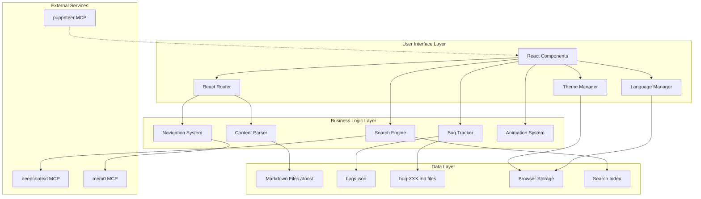

# Design Document: Premium Documentation System

## Overview

Premium Documentation System - это современное React приложение для интерактивной технической документации, которое заменяет существующую HTML документацию проекта TrueOrDO. Система предоставляет богатый пользовательский опыт с интерактивными компонентами, полнотекстовым поиском, встроенным баг-трекером и премиальными визуальными эффектами на базе WebGL.

### Цели системы

1. **Интерактивность**: Предоставить интерактивные таблицы, диаграммы, графики и блоки кода
2. **Производительность**: Обеспечить быструю загрузку и плавную работу (60 FPS)
3. **Поиск**: Реализовать мощный полнотекстовый поиск с живыми результатами
4. **Управление задачами**: Встроенный баг-трекер для отслеживания проблем
5. **Премиальный UX**: WebGL эффекты, плавные анимации, тёмная/светлая темы
6. **Мультиязычность**: Поддержка русского и английского языков

### Технологический стек

- **Frontend Framework**: React 18+ с TypeScript
- **Build Tool**: Vite
- **Routing**: React Router v6
- **Styling**: Tailwind CSS + CSS Variables
- **UI Components**: shadcn/ui + 21st.dev
- **Animations**: Framer Motion
- **Markdown**: react-markdown + remark-gfm
- **Code Highlighting**: react-syntax-highlighter
- **Diagrams**: Mermaid
- **Charts**: recharts
- **WebGL**: Three.js или custom shaders
- **Search**: Custom full-text search + deepcontext MCP
- **Testing**: Vitest + React Testing Library + Puppeteer MCP


## Architecture

### High-Level Architecture

Система построена на модульной архитектуре с четким разделением ответственности:



### Архитектурные принципы

1. **Separation of Concerns**: Код приложения (/docs-app/) отделен от контента (/docs/)
2. **Component-Based**: Переиспользуемые React компоненты с четкими интерфейсами
3. **Performance First**: Code splitting, lazy loading, кеширование
4. **Progressive Enhancement**: Graceful degradation для WebGL и сложных эффектов
5. **Type Safety**: Строгая типизация с TypeScript
6. **Accessibility**: Keyboard navigation и screen reader support

### Структура директорий

```
/
├── docs-app/                 # React приложение
│   ├── src/
│   │   ├── components/       # React компоненты
│   │   │   ├── layout/       # Layout компоненты
│   │   │   ├── ui/           # UI компоненты (shadcn/ui)
│   │   │   ├── interactive/  # Интерактивные компоненты
│   │   │   ├── search/       # Компоненты поиска
│   │   │   └── bugs/         # Компоненты баг-трекера
│   │   ├── pages/            # Страницы (роуты)
│   │   ├── lib/              # Утилиты и хелперы
│   │   │   ├── parser/       # Markdown парсер
│   │   │   ├── search/       # Поисковый движок
│   │   │   ├── bugs/         # Логика баг-трекера
│   │   │   └── webgl/        # WebGL шейдеры
│   │   ├── hooks/            # Custom React hooks
│   │   ├── contexts/         # React contexts
│   │   ├── types/            # TypeScript типы
│   │   ├── config/           # Конфигурация
│   │   └── styles/           # Глобальные стили
│   ├── public/               # Статические файлы
│   └── package.json
│
└── docs/                     # Markdown контент
    ├── api/                  # API документация
    ├── technical/            # Технические разделы
    │   ├── auth.md
    │   ├── client.md
    │   ├── server.md
    │   ├── database.md
    │   ├── games.md
    │   ├── social.md
    │   ├── stats.md
    │   ├── subscription.md
    │   ├── deploy.md
    │   └── design.md
    ├── guides/               # Руководства
    ├── plan/                 # Баг-трекер
    │   ├── bugs.json         # Метаданные багов
    │   └── bug-XXX.md        # Детальные описания
    └── config.json           # Конфигурация контента
```


## Components and Interfaces

### Core Modules

#### 1. Content Parser Module

**Ответственность**: Парсинг Markdown файлов в React компоненты

**Интерфейс**:
```typescript
interface ContentParser {
  parseMarkdown(content: string): ReactElement;
  parseWithCache(filePath: string): Promise<ReactElement>;
  clearCache(): void;
}

interface MarkdownComponents {
  code: ComponentType<CodeProps>;
  table: ComponentType<TableProps>;
  pre: ComponentType<PreProps>;
  // ... другие компоненты
}
```

**Компоненты**:
- `MarkdownRenderer`: Основной компонент рендеринга
- `CodeBlock`: Блок кода с подсветкой
- `InteractiveTable`: Интерактивная таблица
- `MermaidDiagram`: Диаграммы Mermaid

**Алгоритм парсинга**:
1. Загрузить Markdown файл из /docs/
2. Проверить кеш парсенного контента
3. Если в кеше - вернуть закешированный результат
4. Иначе - парсить с помощью react-markdown + remark-gfm
5. Заменить стандартные компоненты на кастомные (code → CodeBlock, table → InteractiveTable)
6. Сохранить результат в кеш
7. Вернуть React элементы

#### 2. Search Engine Module

**Ответственность**: Полнотекстовый поиск по документации

**Интерфейс**:
```typescript
interface SearchEngine {
  indexContent(documents: Document[]): Promise<void>;
  search(query: string, filters?: SearchFilters): SearchResult[];
  highlightMatches(text: string, query: string): string;
}

interface Document {
  id: string;
  title: string;
  content: string;
  section: string;
  path: string;
  metadata: Record<string, any>;
}

interface SearchResult {
  document: Document;
  score: number;
  matches: TextMatch[];
}

interface TextMatch {
  text: string;
  start: number;
  end: number;
  context: string;
}

interface SearchFilters {
  sections?: string[];
  contentTypes?: string[];
}
```

**Компоненты**:
- `SearchModal`: Модальное окно поиска (Cmd+K / Ctrl+K)
- `SearchInput`: Поле ввода с live search
- `SearchResults`: Список результатов
- `SearchFilters`: Фильтры по секциям и типам

**Алгоритм поиска**:
1. Пользователь вводит запрос
2. Debounce 200ms для оптимизации
3. Токенизировать запрос (разбить на слова)
4. Для каждого документа в индексе:
   - Вычислить TF-IDF score для каждого токена
   - Суммировать scores
5. Применить фильтры (секция, тип контента)
6. Отсортировать по score (descending)
7. Взять top 20 результатов
8. Для каждого результата найти контекст (±50 символов вокруг совпадения)
9. Подсветить совпадения в контексте
10. Вернуть результаты

**Интеграция с deepcontext MCP**:
- При инициализации приложения индексировать все Markdown файлы
- Отправить индекс в deepcontext MCP для расширенного поиска
- При поиске использовать локальный индекс для быстрых результатов
- Для сложных запросов обращаться к deepcontext MCP


#### 3. Bug Tracker Module

**Ответственность**: Управление багами и задачами

**Интерфейс**:
```typescript
interface BugTracker {
  getAllBugs(): Promise<BugEntry[]>;
  getBugById(id: string): Promise<BugDetail | null>;
  createBug(data: BugFormData): Promise<BugEntry>;
  updateBug(id: string, data: Partial<BugFormData>): Promise<BugEntry>;
  deleteBug(id: string): Promise<void>;
}

interface BugEntry {
  id: string;
  title: string;
  priority: 'low' | 'medium' | 'high' | 'critical';
  status: 'open' | 'in-progress' | 'resolved' | 'closed';
  createdAt: string;
  updatedAt: string;
  tags: string[];
}

interface BugDetail extends BugEntry {
  description: string;
  stepsToReproduce?: string;
  expectedBehavior?: string;
  actualBehavior?: string;
  attachments?: string[];
}

interface BugFormData {
  title: string;
  description: string;
  priority: BugEntry['priority'];
  status: BugEntry['status'];
  tags?: string[];
  stepsToReproduce?: string;
  expectedBehavior?: string;
  actualBehavior?: string;
}
```

**Компоненты**:
- `BugList`: Таблица со списком багов
- `BugForm`: Форма создания/редактирования бага
- `BugDetail`: Детальная страница бага
- `BugFilters`: Фильтры по приоритету, статусу, дате

**Хранение данных**:

1. **bugs.json** - метаданные всех багов:
```json
{
  "bugs": [
    {
      "id": "001",
      "title": "Search не работает с кириллицей",
      "priority": "high",
      "status": "open",
      "createdAt": "2024-01-15T10:30:00Z",
      "updatedAt": "2024-01-15T10:30:00Z",
      "tags": ["search", "i18n"]
    }
  ],
  "nextId": 2
}
```

2. **bug-XXX.md** - детальное описание:
```markdown
# Bug #001: Search не работает с кириллицей

**Priority**: High
**Status**: Open
**Created**: 2024-01-15
**Tags**: search, i18n

## Description
Поиск не находит результаты при вводе кириллических символов.

## Steps to Reproduce
1. Открыть поиск (Cmd+K)
2. Ввести "документация"
3. Результаты не отображаются

## Expected Behavior
Поиск должен находить страницы с кириллическим текстом.

## Actual Behavior
Результаты пустые.
```

**Алгоритм создания бага**:
1. Валидировать форму (title обязателен)
2. Сгенерировать ID (следующий номер из bugs.json)
3. Создать BugEntry объект
4. Добавить в bugs.json
5. Создать bug-XXX.md файл с детальным описанием
6. Сохранить оба файла
7. Обновить UI


#### 4. Navigation System Module

**Ответственность**: Навигация, breadcrumbs, TOC, progress tracking

**Интерфейс**:
```typescript
interface NavigationSystem {
  getCurrentPath(): string;
  navigateTo(path: string, anchor?: string): void;
  getBreadcrumbs(): Breadcrumb[];
  getTableOfContents(): TOCItem[];
  getReadingProgress(): number;
}

interface Breadcrumb {
  label: string;
  path: string;
}

interface TOCItem {
  id: string;
  title: string;
  level: number;
  children?: TOCItem[];
}

interface NavigationConfig {
  sections: Section[];
}

interface Section {
  id: string;
  title: string;
  path: string;
  icon?: string;
  description?: string;
  children?: Section[];
}
```

**Компоненты**:
- `Sidebar`: Боковая навигация с древовидной структурой
- `Breadcrumbs`: Хлебные крошки
- `TableOfContents`: Оглавление текущей страницы
- `ProgressBar`: Индикатор прогресса чтения
- `ScrollToTop`: Кнопка возврата наверх

**Алгоритм генерации TOC**:
1. Парсить Markdown контент
2. Извлечь все заголовки (h1-h6)
3. Построить иерархическую структуру:
   - h1 → level 1
   - h2 → level 2 (child of h1)
   - h3 → level 3 (child of h2)
4. Сгенерировать ID для каждого заголовка (slug from title)
5. Вернуть массив TOCItem

**Алгоритм вычисления reading progress**:
```typescript
function calculateReadingProgress(): number {
  const scrollTop = window.scrollY;
  const docHeight = document.documentElement.scrollHeight;
  const windowHeight = window.innerHeight;
  const scrollableHeight = docHeight - windowHeight;
  
  if (scrollableHeight <= 0) return 100;
  
  return Math.min(100, (scrollTop / scrollableHeight) * 100);
}
```

#### 5. Theme Manager Module

**Ответственность**: Управление темами оформления

**Интерфейс**:
```typescript
interface ThemeManager {
  getCurrentTheme(): Theme;
  setTheme(theme: Theme): void;
  toggleTheme(): void;
}

type Theme = 'light' | 'dark';

interface ThemeColors {
  background: string;
  foreground: string;
  primary: string;
  secondary: string;
  accent: string;
  muted: string;
  border: string;
  // ... другие цвета
}
```

**CSS Variables**:
```css
:root {
  /* Light theme */
  --background: 0 0% 100%;
  --foreground: 222.2 84% 4.9%;
  --primary: 222.2 47.4% 11.2%;
  --primary-foreground: 210 40% 98%;
  /* ... */
}

.dark {
  /* Dark theme */
  --background: 222.2 84% 4.9%;
  --foreground: 210 40% 98%;
  --primary: 210 40% 98%;
  --primary-foreground: 222.2 47.4% 11.2%;
  /* ... */
}
```

**Алгоритм переключения темы**:
1. Получить текущую тему из localStorage
2. Определить новую тему (toggle: light ↔ dark)
3. Добавить/удалить класс 'dark' на document.documentElement
4. Сохранить выбор в localStorage
5. Применить CSS переменные
6. Обновить WebGL шейдеры (если активны)


#### 6. Language Manager Module

**Ответственность**: Мультиязычность интерфейса

**Интерфейс**:
```typescript
interface LanguageManager {
  getCurrentLanguage(): Language;
  setLanguage(lang: Language): void;
  translate(key: string, params?: Record<string, any>): string;
}

type Language = 'ru' | 'en';

interface Translations {
  [key: string]: {
    ru: string;
    en: string;
  };
}
```

**Структура переводов**:
```typescript
const translations: Translations = {
  'nav.home': {
    ru: 'Главная',
    en: 'Home'
  },
  'nav.api': {
    ru: 'API',
    en: 'API'
  },
  'search.placeholder': {
    ru: 'Поиск в документации...',
    en: 'Search documentation...'
  },
  'bug.create': {
    ru: 'Создать баг',
    en: 'Create Bug'
  },
  // ... другие переводы
};
```

**Примечание**: Контент Markdown файлов НЕ переводится автоматически. Для мультиязычного контента нужны отдельные файлы (например, `auth.ru.md` и `auth.en.md`).

#### 7. Animation System Module

**Ответственность**: Анимации и transitions

**Интерфейс**:
```typescript
interface AnimationSystem {
  pageTransition: Variants;
  fadeIn: Variants;
  slideIn: Variants;
  scaleIn: Variants;
  staggerChildren: Variants;
}

// Framer Motion Variants
type Variants = {
  initial: MotionProps;
  animate: MotionProps;
  exit?: MotionProps;
};
```

**Предустановленные анимации**:

```typescript
const animations = {
  pageTransition: {
    initial: { opacity: 0, y: 20 },
    animate: { opacity: 1, y: 0 },
    exit: { opacity: 0, y: -20 },
    transition: { duration: 0.3, ease: 'easeInOut' }
  },
  
  fadeIn: {
    initial: { opacity: 0 },
    animate: { opacity: 1 },
    transition: { duration: 0.4 }
  },
  
  slideInFromLeft: {
    initial: { x: -50, opacity: 0 },
    animate: { x: 0, opacity: 1 },
    transition: { duration: 0.4, ease: 'easeOut' }
  },
  
  scaleIn: {
    initial: { scale: 0.9, opacity: 0 },
    animate: { scale: 1, opacity: 1 },
    transition: { duration: 0.3 }
  },
  
  staggerChildren: {
    animate: {
      transition: {
        staggerChildren: 0.1
      }
    }
  }
};
```

**Micro-interactions**:
- Button hover: scale(1.05) + shadow
- Card hover: translateY(-4px) + shadow
- Input focus: border glow animation
- Copy button: ripple effect
- Checkbox: checkmark draw animation


#### 8. WebGL Background Module

**Ответственность**: Шейдерные фоны для премиального визуала

**Интерфейс**:
```typescript
interface WebGLBackground {
  initialize(canvas: HTMLCanvasElement): void;
  setTheme(theme: Theme): void;
  resize(width: number, height: number): void;
  animate(): void;
  dispose(): void;
}

interface ShaderConfig {
  vertexShader: string;
  fragmentShader: string;
  uniforms: Record<string, any>;
}
```

**Шейдеры**:

1. **Gradient Flow** (для Hub Page):
```glsl
// Fragment Shader
uniform float u_time;
uniform vec2 u_resolution;
uniform vec3 u_color1;
uniform vec3 u_color2;

void main() {
  vec2 uv = gl_FragCoord.xy / u_resolution;
  
  // Animated gradient
  float wave = sin(uv.x * 3.0 + u_time * 0.5) * 0.5 + 0.5;
  vec3 color = mix(u_color1, u_color2, wave);
  
  // Add noise
  float noise = fract(sin(dot(uv, vec2(12.9898, 78.233))) * 43758.5453);
  color += noise * 0.05;
  
  gl_FragColor = vec4(color, 1.0);
}
```

2. **Particle Field** (для Section pages):
```glsl
// Fragment Shader
uniform float u_time;
uniform vec2 u_resolution;
uniform vec3 u_color;

float random(vec2 st) {
  return fract(sin(dot(st, vec2(12.9898, 78.233))) * 43758.5453);
}

void main() {
  vec2 uv = gl_FragCoord.xy / u_resolution;
  
  // Create particle grid
  vec2 grid = floor(uv * 20.0);
  float particle = random(grid);
  
  // Animate particles
  float pulse = sin(u_time + particle * 6.28) * 0.5 + 0.5;
  
  // Render
  vec3 color = u_color * pulse * 0.3;
  gl_FragColor = vec4(color, 1.0);
}
```

**Fallback стратегия**:
```typescript
function initializeBackground(element: HTMLElement): void {
  try {
    // Try WebGL
    const canvas = document.createElement('canvas');
    const gl = canvas.getContext('webgl2') || canvas.getContext('webgl');
    
    if (!gl) throw new Error('WebGL not supported');
    
    // Initialize WebGL background
    const background = new WebGLBackground(gl);
    background.initialize();
    
  } catch (error) {
    // Fallback to CSS gradient
    element.style.background = 'linear-gradient(135deg, var(--primary) 0%, var(--secondary) 100%)';
  }
}
```

**Performance monitoring**:
```typescript
function monitorFPS(): void {
  let lastTime = performance.now();
  let frames = 0;
  
  function checkFPS() {
    frames++;
    const currentTime = performance.now();
    
    if (currentTime >= lastTime + 1000) {
      const fps = Math.round((frames * 1000) / (currentTime - lastTime));
      
      if (fps < 50) {
        // Disable WebGL, use static gradient
        disableWebGL();
      }
      
      frames = 0;
      lastTime = currentTime;
    }
    
    requestAnimationFrame(checkFPS);
  }
  
  checkFPS();
}
```


### Interactive Components

#### CodeBlock Component

**Props**:
```typescript
interface CodeBlockProps {
  code: string;
  language: string;
  showLineNumbers?: boolean;
  highlightLines?: number[];
  showCopyButton?: boolean;
  fileName?: string;
  diff?: boolean;
}
```

**Функциональность**:
- Syntax highlighting с react-syntax-highlighter
- Monospace шрифты (JetBrains Mono, Fira Code, Cascadia Code)
- Line numbers
- Copy to clipboard с ripple анимацией
- Highlight specific lines
- Diff view (+ зеленый, - красный)

**Пример использования**:
```tsx
<CodeBlock
  code={`function hello() {\n  console.log("Hello");\n}`}
  language="typescript"
  showLineNumbers
  highlightLines={[2]}
  showCopyButton
/>
```

#### InteractiveTable Component

**Props**:
```typescript
interface InteractiveTableProps {
  data: any[];
  columns: Column[];
  sortable?: boolean;
  filterable?: boolean;
  searchable?: boolean;
  exportable?: boolean;
  stickyHeader?: boolean;
  pageSize?: number;
}

interface Column {
  key: string;
  title: string;
  sortable?: boolean;
  filterable?: boolean;
  render?: (value: any, row: any) => ReactNode;
}
```

**Функциональность**:
- Column sorting (ascending/descending)
- Column filtering
- Global search
- Export to CSV/JSON
- Sticky headers
- Pagination
- Responsive columns

**Алгоритм сортировки**:
```typescript
function sortData(data: any[], column: string, direction: 'asc' | 'desc'): any[] {
  return [...data].sort((a, b) => {
    const aVal = a[column];
    const bVal = b[column];
    
    // Handle different types
    if (typeof aVal === 'string') {
      return direction === 'asc' 
        ? aVal.localeCompare(bVal)
        : bVal.localeCompare(aVal);
    }
    
    if (typeof aVal === 'number') {
      return direction === 'asc' 
        ? aVal - bVal
        : bVal - aVal;
    }
    
    return 0;
  });
}
```

**Алгоритм экспорта в CSV**:
```typescript
function exportToCSV(data: any[], columns: Column[]): void {
  // Generate CSV header
  const header = columns.map(col => col.title).join(',');
  
  // Generate CSV rows
  const rows = data.map(row => 
    columns.map(col => {
      const value = row[col.key];
      // Escape commas and quotes
      return typeof value === 'string' && value.includes(',')
        ? `"${value.replace(/"/g, '""')}"`
        : value;
    }).join(',')
  );
  
  // Combine and download
  const csv = [header, ...rows].join('\n');
  const blob = new Blob([csv], { type: 'text/csv' });
  const url = URL.createObjectURL(blob);
  
  const a = document.createElement('a');
  a.href = url;
  a.download = 'export.csv';
  a.click();
  
  URL.revokeObjectURL(url);
}
```


#### MermaidDiagram Component

**Props**:
```typescript
interface MermaidDiagramProps {
  chart: string;
  zoomable?: boolean;
  pannable?: boolean;
  exportable?: boolean;
  theme?: 'light' | 'dark';
}
```

**Функциональность**:
- Render Mermaid diagrams
- Zoom in/out
- Pan (drag to move)
- Click on elements for details
- Export to PNG/SVG

**Пример**:
```tsx
<MermaidDiagram
  chart={`
    graph TD
      A[Client] --> B[Server]
      B --> C[Database]
  `}
  zoomable
  pannable
  exportable
/>
```

**Алгоритм экспорта в SVG**:
```typescript
async function exportToSVG(element: HTMLElement): Promise<void> {
  // Get SVG element from Mermaid
  const svg = element.querySelector('svg');
  if (!svg) return;
  
  // Clone and clean up
  const clone = svg.cloneNode(true) as SVGElement;
  
  // Serialize to string
  const serializer = new XMLSerializer();
  const svgString = serializer.serializeToString(clone);
  
  // Create blob and download
  const blob = new Blob([svgString], { type: 'image/svg+xml' });
  const url = URL.createObjectURL(blob);
  
  const a = document.createElement('a');
  a.href = url;
  a.download = 'diagram.svg';
  a.click();
  
  URL.revokeObjectURL(url);
}
```

#### Chart Component

**Props**:
```typescript
interface ChartProps {
  data: ChartData[];
  type: 'line' | 'bar' | 'area' | 'pie';
  xKey: string;
  yKey: string;
  title?: string;
  zoomable?: boolean;
  exportable?: boolean;
}

interface ChartData {
  [key: string]: any;
}
```

**Функциональность**:
- Render charts с recharts
- Interactive tooltips
- Zoom functionality
- Export to PNG

**Пример**:
```tsx
<Chart
  data={[
    { month: 'Jan', users: 100 },
    { month: 'Feb', users: 150 },
    { month: 'Mar', users: 200 }
  ]}
  type="line"
  xKey="month"
  yKey="users"
  title="User Growth"
  zoomable
  exportable
/>
```


## Data Models

### Configuration Model

**config.json** (в /docs/):
```typescript
interface AppConfig {
  version: string;
  sections: SectionConfig[];
  theme: ThemeConfig;
  search: SearchConfig;
  animations: AnimationConfig;
}

interface SectionConfig {
  id: string;
  title: {
    ru: string;
    en: string;
  };
  description: {
    ru: string;
    en: string;
  };
  path: string;
  icon: string;
  children?: SectionConfig[];
}

interface ThemeConfig {
  defaultTheme: 'light' | 'dark';
  colors: {
    light: ColorScheme;
    dark: ColorScheme;
  };
}

interface ColorScheme {
  background: string;
  foreground: string;
  primary: string;
  secondary: string;
  accent: string;
  muted: string;
  border: string;
  card: string;
  cardForeground: string;
}

interface SearchConfig {
  debounceMs: number;
  maxResults: number;
  minQueryLength: number;
  indexingEnabled: boolean;
}

interface AnimationConfig {
  enabled: boolean;
  duration: {
    fast: number;
    normal: number;
    slow: number;
  };
  easing: string;
}
```

**Пример config.json**:
```json
{
  "version": "1.0.0",
  "sections": [
    {
      "id": "api",
      "title": {
        "ru": "API Документация",
        "en": "API Documentation"
      },
      "description": {
        "ru": "Полное описание REST API",
        "en": "Complete REST API reference"
      },
      "path": "/api",
      "icon": "code"
    },
    {
      "id": "technical",
      "title": {
        "ru": "Технические разделы",
        "en": "Technical Sections"
      },
      "description": {
        "ru": "Архитектура и технические детали",
        "en": "Architecture and technical details"
      },
      "path": "/technical",
      "icon": "cog",
      "children": [
        {
          "id": "auth",
          "title": { "ru": "Аутентификация", "en": "Authentication" },
          "path": "/technical/auth",
          "icon": "lock"
        },
        {
          "id": "database",
          "title": { "ru": "База данных", "en": "Database" },
          "path": "/technical/database",
          "icon": "database"
        }
      ]
    }
  ],
  "theme": {
    "defaultTheme": "dark",
    "colors": {
      "light": {
        "background": "0 0% 100%",
        "foreground": "222.2 84% 4.9%",
        "primary": "222.2 47.4% 11.2%",
        "secondary": "210 40% 96.1%",
        "accent": "210 40% 96.1%",
        "muted": "210 40% 96.1%",
        "border": "214.3 31.8% 91.4%",
        "card": "0 0% 100%",
        "cardForeground": "222.2 84% 4.9%"
      },
      "dark": {
        "background": "222.2 84% 4.9%",
        "foreground": "210 40% 98%",
        "primary": "210 40% 98%",
        "secondary": "217.2 32.6% 17.5%",
        "accent": "217.2 32.6% 17.5%",
        "muted": "217.2 32.6% 17.5%",
        "border": "217.2 32.6% 17.5%",
        "card": "222.2 84% 4.9%",
        "cardForeground": "210 40% 98%"
      }
    }
  },
  "search": {
    "debounceMs": 200,
    "maxResults": 20,
    "minQueryLength": 2,
    "indexingEnabled": true
  },
  "animations": {
    "enabled": true,
    "duration": {
      "fast": 150,
      "normal": 300,
      "slow": 500
    },
    "easing": "cubic-bezier(0.4, 0, 0.2, 1)"
  }
}
```


### Bug Tracker Data Model

**bugs.json**:
```typescript
interface BugsDatabase {
  bugs: BugEntry[];
  nextId: number;
  metadata: {
    lastUpdated: string;
    totalBugs: number;
    openBugs: number;
    resolvedBugs: number;
  };
}

interface BugEntry {
  id: string;
  title: string;
  priority: 'low' | 'medium' | 'high' | 'critical';
  status: 'open' | 'in-progress' | 'resolved' | 'closed';
  createdAt: string; // ISO 8601
  updatedAt: string; // ISO 8601
  tags: string[];
  assignee?: string;
  markdownFile: string; // Path to bug-XXX.md
}
```

**Пример bugs.json**:
```json
{
  "bugs": [
    {
      "id": "001",
      "title": "Search не работает с кириллицей",
      "priority": "high",
      "status": "open",
      "createdAt": "2024-01-15T10:30:00Z",
      "updatedAt": "2024-01-15T10:30:00Z",
      "tags": ["search", "i18n"],
      "markdownFile": "bug-001.md"
    },
    {
      "id": "002",
      "title": "WebGL фон лагает на старых GPU",
      "priority": "medium",
      "status": "in-progress",
      "createdAt": "2024-01-16T14:20:00Z",
      "updatedAt": "2024-01-17T09:15:00Z",
      "tags": ["webgl", "performance"],
      "assignee": "developer@example.com",
      "markdownFile": "bug-002.md"
    }
  ],
  "nextId": 3,
  "metadata": {
    "lastUpdated": "2024-01-17T09:15:00Z",
    "totalBugs": 2,
    "openBugs": 1,
    "resolvedBugs": 0
  }
}
```

**bug-XXX.md структура**:
```markdown
---
id: "001"
title: "Search не работает с кириллицей"
priority: high
status: open
createdAt: 2024-01-15T10:30:00Z
updatedAt: 2024-01-15T10:30:00Z
tags: [search, i18n]
---

# Bug #001: Search не работает с кириллицей

## Description

Поиск не находит результаты при вводе кириллических символов в поле поиска.

## Steps to Reproduce

1. Открыть поиск (Cmd+K или Ctrl+K)
2. Ввести запрос на русском языке, например "документация"
3. Нажать Enter или подождать live search

## Expected Behavior

Поиск должен находить все страницы, содержащие слово "документация" в заголовке или тексте.

## Actual Behavior

Результаты поиска пустые. Поиск работает только с латинскими символами.

## Technical Details

- Browser: Chrome 120
- OS: macOS 14
- Search Engine: Custom full-text search
- Tokenizer: не поддерживает Unicode

## Possible Solution

Использовать Unicode-aware tokenizer или библиотеку для работы с мультиязычным текстом.

## Related Issues

- #003: Поиск не работает с японскими символами

## Comments

### 2024-01-15 10:45 - developer@example.com
Проблема в tokenizer'е. Нужно добавить поддержку Unicode word boundaries.

### 2024-01-15 11:00 - developer@example.com
Рассматриваю использование библиотеки `unicode-segmenter`.
```


### Search Index Model

**Структура индекса**:
```typescript
interface SearchIndex {
  documents: IndexedDocument[];
  invertedIndex: InvertedIndex;
  metadata: IndexMetadata;
}

interface IndexedDocument {
  id: string;
  title: string;
  content: string;
  section: string;
  path: string;
  tokens: string[];
  metadata: {
    wordCount: number;
    headings: string[];
    tags: string[];
  };
}

interface InvertedIndex {
  [token: string]: PostingsList;
}

interface PostingsList {
  documentIds: string[];
  positions: {
    [docId: string]: number[]; // Positions of token in document
  };
  idf: number; // Inverse Document Frequency
}

interface IndexMetadata {
  totalDocuments: number;
  totalTokens: number;
  averageDocumentLength: number;
  lastIndexed: string;
}
```

**Пример индекса**:
```json
{
  "documents": [
    {
      "id": "api-auth",
      "title": "Authentication API",
      "content": "The authentication API provides endpoints for user login...",
      "section": "api",
      "path": "/api/auth",
      "tokens": ["authentication", "api", "provides", "endpoints", "user", "login"],
      "metadata": {
        "wordCount": 250,
        "headings": ["Overview", "Endpoints", "Examples"],
        "tags": ["api", "auth"]
      }
    }
  ],
  "invertedIndex": {
    "authentication": {
      "documentIds": ["api-auth", "technical-auth"],
      "positions": {
        "api-auth": [0, 45, 120],
        "technical-auth": [10, 89]
      },
      "idf": 0.693
    },
    "api": {
      "documentIds": ["api-auth", "api-users", "api-games"],
      "positions": {
        "api-auth": [1, 50],
        "api-users": [0, 30],
        "api-games": [0, 25]
      },
      "idf": 0.405
    }
  },
  "metadata": {
    "totalDocuments": 50,
    "totalTokens": 15000,
    "averageDocumentLength": 300,
    "lastIndexed": "2024-01-17T10:00:00Z"
  }
}
```

### Page Metadata Model

**Frontmatter в Markdown файлах**:
```typescript
interface PageMetadata {
  title: string;
  description?: string;
  section: string;
  tags?: string[];
  author?: string;
  lastUpdated?: string;
  toc?: boolean; // Show table of contents
  webgl?: boolean; // Enable WebGL background
  breadcrumbs?: Breadcrumb[];
}
```

**Пример**:
```markdown
---
title: "Authentication System"
description: "Complete guide to authentication in TrueOrDO"
section: "technical"
tags: ["auth", "security", "jwt"]
author: "Tech Team"
lastUpdated: "2024-01-15"
toc: true
webgl: false
---

# Authentication System

Content here...
```


## Correctness Properties

*A property is a characteristic or behavior that should hold true across all valid executions of a system-essentially, a formal statement about what the system should do. Properties serve as the bridge between human-readable specifications and machine-verifiable correctness guarantees.*

### Property 1: Markdown Parsing Round-Trip

*For any* valid Markdown content, parsing it into React elements and then serializing those elements back should produce semantically equivalent content.

**Validates: Requirements 2.6**

### Property 2: Code Block Rendering

*For any* Markdown file containing code blocks (fenced with triple backticks), the Content Parser should render each code block as a CodeBlock component with syntax highlighting and line numbers.

**Validates: Requirements 2.3, 7.3, 7.4**

### Property 3: Mermaid Diagram Rendering

*For any* Markdown file containing Mermaid diagram syntax, the Content Parser should render it as an interactive Diagram component with zoom and pan capabilities.

**Validates: Requirements 2.4, 8.1, 8.2, 8.3**

### Property 4: Table Rendering and Interactivity

*For any* Markdown file containing table syntax, the Content Parser should render it as an InteractiveTable component with sorting, filtering, and search capabilities.

**Validates: Requirements 2.5, 6.1, 6.2, 6.3, 6.7**

### Property 5: Navigation Click Behavior

*For any* clickable navigation element (Section card, tree node, endpoint, bug entry), clicking it should navigate to the corresponding page and update the URL and breadcrumbs accordingly.

**Validates: Requirements 3.4, 4.2, 4.3, 5.3, 11.9**

### Property 6: Table of Contents Generation

*For any* page with heading elements (h1-h6), the Navigation System should generate a hierarchical table of contents that includes all headings with correct nesting levels and anchor links.

**Validates: Requirements 3.6**

### Property 7: Reading Progress Calculation

*For any* scroll position on a page, the reading progress bar should display a percentage that accurately reflects the ratio of scrolled content to total scrollable content (0% at top, 100% at bottom).

**Validates: Requirements 3.9**

### Property 8: Breadcrumbs Accuracy

*For any* page in the documentation, the breadcrumbs should display the complete path from the root (Hub) to the current page, with each breadcrumb being clickable and navigating to the correct location.

**Validates: Requirements 3.5**

### Property 9: API Endpoint Information Completeness

*For any* API endpoint displayed in the documentation, the system should show all required fields: HTTP method, URL, parameters, request example, response format, and response example.

**Validates: Requirements 4.4, 4.5**

### Property 10: Table Sticky Headers

*For any* table with data rows, when the user scrolls vertically, the column headers should remain visible at the top of the viewport (sticky positioning).

**Validates: Requirements 6.6**

### Property 11: Data Export Format Correctness

*For any* table with data, exporting to CSV should produce a valid CSV file where each row corresponds to a data row and columns match the table structure, and exporting to JSON should produce valid JSON with the same data structure.

**Validates: Requirements 6.4, 6.5, 21.1, 21.2**

### Property 12: Code Copy to Clipboard

*For any* code block, clicking the copy button should copy the exact code content (without line numbers or syntax highlighting markup) to the system clipboard.

**Validates: Requirements 7.5**

### Property 13: Code Line Highlighting

*For any* code block with specified highlight lines, those lines should be visually distinguished from non-highlighted lines in the rendered output.

**Validates: Requirements 7.7**

### Property 14: Code Diff View

*For any* code block marked as diff, lines prefixed with '+' should be rendered in green (additions) and lines prefixed with '-' should be rendered in red (deletions).

**Validates: Requirements 7.8**

### Property 15: Diagram Element Interaction

*For any* diagram element that is clicked, the system should display a tooltip or modal with details about that element (if metadata is available).

**Validates: Requirements 8.4**

### Property 16: Diagram Export Formats

*For any* diagram, the system should support exporting to both PNG (raster) and SVG (vector) formats, with the exported files being valid and renderable in standard image viewers.

**Validates: Requirements 8.5, 8.6, 21.3, 21.4**

### Property 17: Chart Tooltip Display

*For any* data point on a chart, hovering over it should display a tooltip containing the detailed information for that data point (x-value, y-value, and any additional metadata).

**Validates: Requirements 9.2, 9.5**

### Property 18: Chart Export

*For any* chart, exporting to PNG should produce a valid PNG image that accurately represents the current state of the chart visualization.

**Validates: Requirements 9.4, 21.5**

### Property 19: Search Result Relevance

*For any* search query, all returned results should contain at least one occurrence of at least one token from the query, and results should be ranked by relevance score in descending order.

**Validates: Requirements 10.1**

### Property 20: Search Result Highlighting

*For any* search result, the matching text fragments should be highlighted (e.g., wrapped in <mark> tags or styled differently) to show where the query matched.

**Validates: Requirements 10.3**

### Property 21: Search Filtering

*For any* search query with section or content type filters applied, all returned results should match the filter criteria (belong to the specified section or content type).

**Validates: Requirements 10.4, 10.5**

### Property 22: Search Result Navigation

*For any* search result that is clicked, the system should navigate to the corresponding page and scroll to the anchor where the match occurred (if an anchor is available).

**Validates: Requirements 10.8**

### Property 23: Bug Creation Persistence

*For any* valid bug form submission, the system should create a new entry in bugs.json with a unique ID and create a corresponding bug-XXX.md file with the detailed description.

**Validates: Requirements 11.4, 11.5, 11.6**

### Property 24: Bug List Filtering

*For any* bug list with filters applied (priority, status, or date), all displayed bugs should match the filter criteria.

**Validates: Requirements 11.8**

### Property 25: Theme Toggle

*For any* theme (light or dark), clicking the theme toggle button should switch to the opposite theme and update the UI colors accordingly.

**Validates: Requirements 12.4**

### Property 26: Settings Persistence Round-Trip

*For any* user preference (theme or language), setting the preference, reloading the page, and checking the preference should return the same value that was set (round-trip through localStorage).

**Validates: Requirements 12.5, 12.6, 13.5, 13.6**

### Property 27: Language Toggle

*For any* language (Russian or English), clicking the language toggle button should switch to the opposite language and update all UI text to the selected language.

**Validates: Requirements 13.4**

### Property 28: Background Type Selection

*For any* page, if the page is primarily text content (e.g., documentation pages), the system should display a static gradient background; if the page is a hub or section landing page, the system should display a WebGL shader background (with fallback to gradient if WebGL fails).

**Validates: Requirements 14.3**

### Property 29: WebGL Viewport Responsiveness

*For any* WebGL background, resizing the viewport should cause the WebGL canvas to resize and re-render to match the new viewport dimensions without distortion.

**Validates: Requirements 14.5**

### Property 30: Page Transition Animation

*For any* navigation between pages, the system should apply a fade-in animation to the new page content.

**Validates: Requirements 15.1**

### Property 31: Scroll-Based Element Animation

*For any* element with scroll-based animation, when the element enters the viewport during scrolling, it should animate into view (e.g., fade-in or slide-in).

**Validates: Requirements 15.2**

### Property 32: Interactive Element Hover Animation

*For any* interactive element (button, card, link), hovering over it should trigger a visual animation (e.g., scale, shadow, or color change).

**Validates: Requirements 15.3**

### Property 33: Expand/Collapse Animation

*For any* expandable/collapsible element (tree node, accordion), expanding or collapsing should animate smoothly rather than instantly appearing/disappearing.

**Validates: Requirements 15.4**

### Property 34: Smooth Scroll Behavior

*For any* scroll action (clicking anchor link, scroll-to-top button, or search result navigation), the page should scroll smoothly to the target position rather than jumping instantly.

**Validates: Requirements 15.5**

### Property 35: Micro-Interaction Animation

*For any* micro-interaction (button click, checkbox toggle, form input focus), the system should provide visual feedback through animation.

**Validates: Requirements 15.6**

### Property 36: Page Load Performance

*For any* page navigation, the content should be loaded and rendered within 1 second from the navigation action.

**Validates: Requirements 18.1**

### Property 37: Markdown Cache Effectiveness

*For any* Markdown file, loading it a second time should be faster than the first load due to caching (cache hit should return cached result without re-parsing).

**Validates: Requirements 18.3**

### Property 38: Search Performance

*For any* search query, the search engine should return results within 200 milliseconds from the time the query is submitted.

**Validates: Requirements 18.4**

### Property 39: Keyboard Navigation Completeness

*For any* interactive element in the system, it should be reachable and operable using only keyboard input (Tab, Enter, Space, Arrow keys, Escape).

**Validates: Requirements 19.1, 19.4, 19.5, 19.6**

### Property 40: Focus Indicator Visibility

*For any* focusable element, when it receives keyboard focus, it should display a visible focus indicator (outline or border).

**Validates: Requirements 19.2**

### Property 41: Screen Reader Announcements

*For any* dynamic content change (search results appearing, page loading, error messages), the system should provide appropriate ARIA live region announcements for screen readers.

**Validates: Requirements 19.3**

### Property 42: Export Download Trigger

*For any* export action (table, diagram, or chart), the system should trigger a browser download with the appropriate filename and MIME type.

**Validates: Requirements 21.6**

### Property 43: Configuration Loading

*For any* valid configuration file, the system should successfully load and apply all configuration settings (sections, theme colors, animation settings, search options).

**Validates: Requirements 25.1, 25.6**


## Error Handling

### Error Handling Strategy

Система использует многоуровневую стратегию обработки ошибок:

1. **Component-Level Error Boundaries**: Каждый major компонент обернут в Error Boundary
2. **Graceful Degradation**: При ошибках система продолжает работу с ограниченной функциональностью
3. **User-Friendly Messages**: Все ошибки показываются пользователю в понятном виде
4. **Error Logging**: Все ошибки логируются для debugging
5. **Recovery Options**: Пользователю предлагаются опции восстановления

### Error Scenarios

#### 1. Markdown File Loading Errors

**Scenario**: Файл не найден или не может быть загружен

**Handling**:
```typescript
async function loadMarkdownFile(path: string): Promise<string> {
  try {
    const response = await fetch(`/docs/${path}`);
    
    if (!response.ok) {
      throw new Error(`Failed to load ${path}: ${response.status}`);
    }
    
    return await response.text();
    
  } catch (error) {
    console.error('Markdown loading error:', error);
    
    // Show user-friendly error
    return `# Error Loading Content\n\nCould not load file: ${path}\n\nPlease check that the file exists and try again.`;
  }
}
```

**User Experience**:
- Отображается страница с сообщением об ошибке
- Показывается путь к файлу
- Предлагается вернуться на главную или попробовать снова

#### 2. Search Indexing Errors

**Scenario**: Ошибка при индексации контента

**Handling**:
```typescript
async function indexDocuments(documents: Document[]): Promise<void> {
  try {
    for (const doc of documents) {
      try {
        await indexDocument(doc);
      } catch (error) {
        console.error(`Failed to index document ${doc.id}:`, error);
        // Continue with other documents
      }
    }
  } catch (error) {
    console.error('Search indexing error:', error);
    // Search will work with partially indexed content
  }
}
```

**User Experience**:
- Поиск продолжает работать с частично проиндексированным контентом
- В консоли логируется информация об ошибке
- Пользователь не видит ошибку (graceful degradation)

#### 3. WebGL Initialization Errors

**Scenario**: WebGL не поддерживается или не может быть инициализирован

**Handling**:
```typescript
function initializeBackground(element: HTMLElement): void {
  try {
    const canvas = document.createElement('canvas');
    const gl = canvas.getContext('webgl2') || canvas.getContext('webgl');
    
    if (!gl) {
      throw new Error('WebGL not supported');
    }
    
    // Initialize WebGL background
    const background = new WebGLBackground(gl);
    background.initialize();
    
    // Monitor FPS
    monitorFPS((fps) => {
      if (fps < 50) {
        throw new Error('Poor performance');
      }
    });
    
  } catch (error) {
    console.warn('WebGL fallback:', error);
    
    // Fallback to CSS gradient
    element.style.background = 
      'linear-gradient(135deg, hsl(var(--primary)) 0%, hsl(var(--secondary)) 100%)';
  }
}
```

**User Experience**:
- Автоматический fallback на CSS gradient
- Пользователь не видит ошибку
- Визуальный опыт немного упрощается, но остается привлекательным

#### 4. Bug Form Submission Errors

**Scenario**: Ошибка при сохранении бага

**Handling**:
```typescript
async function submitBug(data: BugFormData): Promise<BugEntry> {
  try {
    // Validate data
    if (!data.title || data.title.trim().length === 0) {
      throw new ValidationError('Title is required');
    }
    
    // Create bug entry
    const bug = await createBugEntry(data);
    
    // Save to bugs.json
    await saveBugsJSON(bug);
    
    // Create markdown file
    await createBugMarkdown(bug);
    
    return bug;
    
  } catch (error) {
    console.error('Bug submission error:', error);
    
    if (error instanceof ValidationError) {
      // Show validation error to user
      throw error;
    }
    
    // For other errors, preserve form data
    localStorage.setItem('bug-form-draft', JSON.stringify(data));
    
    throw new Error('Failed to save bug. Your data has been saved locally.');
  }
}
```

**User Experience**:
- Validation errors показываются inline в форме
- При ошибке сохранения данные формы сохраняются в localStorage
- Показывается сообщение с опцией попробовать снова
- При следующем открытии формы данные восстанавливаются

#### 5. Code Copy Errors

**Scenario**: Clipboard API недоступен или ошибка копирования

**Handling**:
```typescript
async function copyToClipboard(text: string): Promise<void> {
  try {
    if (navigator.clipboard) {
      await navigator.clipboard.writeText(text);
    } else {
      // Fallback for older browsers
      const textarea = document.createElement('textarea');
      textarea.value = text;
      textarea.style.position = 'fixed';
      textarea.style.opacity = '0';
      document.body.appendChild(textarea);
      textarea.select();
      document.execCommand('copy');
      document.body.removeChild(textarea);
    }
    
    // Show success notification
    showNotification('Code copied!', 'success');
    
  } catch (error) {
    console.error('Copy error:', error);
    
    // Show error notification with manual copy option
    showNotification('Failed to copy. Please select and copy manually.', 'error');
  }
}
```

**User Experience**:
- При успехе показывается уведомление "Code copied!"
- При ошибке показывается уведомление с инструкцией скопировать вручную
- Код остается выделенным для ручного копирования

#### 6. Critical Errors (Error Boundary)

**Scenario**: Неожиданная ошибка в React компоненте

**Handling**:
```typescript
class ErrorBoundary extends React.Component<Props, State> {
  state = { hasError: false, error: null };
  
  static getDerivedStateFromError(error: Error) {
    return { hasError: true, error };
  }
  
  componentDidCatch(error: Error, errorInfo: ErrorInfo) {
    console.error('Error boundary caught:', error, errorInfo);
  }
  
  render() {
    if (this.state.hasError) {
      return (
        <div className="error-boundary">
          <h1>Something went wrong</h1>
          <p>We're sorry, but something unexpected happened.</p>
          <details>
            <summary>Error details</summary>
            <pre>{this.state.error?.toString()}</pre>
          </details>
          <div className="actions">
            <button onClick={() => window.location.reload()}>
              Reload Page
            </button>
            <button onClick={() => window.location.href = '/'}>
              Go to Home
            </button>
          </div>
        </div>
      );
    }
    
    return this.props.children;
  }
}
```

**User Experience**:
- Показывается friendly error page
- Предлагаются опции: Reload Page или Go to Home
- Детали ошибки доступны в expandable секции
- Остальная часть приложения продолжает работать (если ошибка локальная)

### Error Types

```typescript
// Custom error types
class ValidationError extends Error {
  constructor(message: string) {
    super(message);
    this.name = 'ValidationError';
  }
}

class NetworkError extends Error {
  constructor(message: string, public statusCode?: number) {
    super(message);
    this.name = 'NetworkError';
  }
}

class ParseError extends Error {
  constructor(message: string, public filePath: string) {
    super(message);
    this.name = 'ParseError';
  }
}

class ConfigError extends Error {
  constructor(message: string) {
    super(message);
    this.name = 'ConfigError';
  }
}
```


## Testing Strategy

### Dual Testing Approach

Система использует комбинацию unit testing и property-based testing для обеспечения комплексного покрытия:

- **Unit tests**: Проверяют конкретные примеры, edge cases и интеграционные точки
- **Property tests**: Проверяют универсальные свойства на большом количестве сгенерированных входных данных

Оба подхода дополняют друг друга: unit tests ловят конкретные баги, property tests проверяют общую корректность.

### Testing Tools

- **Test Framework**: Vitest
- **React Testing**: React Testing Library + @testing-library/user-event
- **Property-Based Testing**: fast-check (JavaScript/TypeScript PBT library)
- **E2E Testing**: Puppeteer MCP server
- **Coverage**: Vitest coverage (c8)

### Property-Based Testing Configuration

Каждый property test должен:
- Запускаться минимум 100 итераций (из-за рандомизации)
- Иметь комментарий с ссылкой на design property
- Использовать fast-check для генерации данных

**Формат тега**:
```typescript
// Feature: premium-documentation-system, Property 1: Markdown Parsing Round-Trip
```

### Test Organization

```
docs-app/
├── src/
│   ├── components/
│   │   └── __tests__/
│   │       ├── CodeBlock.test.tsx
│   │       ├── InteractiveTable.test.tsx
│   │       └── ...
│   ├── lib/
│   │   ├── parser/
│   │   │   └── __tests__/
│   │   │       ├── markdown-parser.test.ts
│   │   │       └── markdown-parser.property.test.ts
│   │   ├── search/
│   │   │   └── __tests__/
│   │   │       ├── search-engine.test.ts
│   │   │       └── search-engine.property.test.ts
│   │   └── bugs/
│   │       └── __tests__/
│   │           ├── bug-tracker.test.ts
│   │           └── bug-tracker.property.test.ts
│   └── __tests__/
│       └── integration/
│           ├── navigation.test.tsx
│           ├── search-flow.test.tsx
│           └── bug-workflow.test.tsx
```

### Unit Test Examples

#### Example 1: CodeBlock Component

```typescript
import { render, screen } from '@testing-library/react';
import userEvent from '@testing-library/user-event';
import { CodeBlock } from '../CodeBlock';

describe('CodeBlock', () => {
  it('should render code with line numbers', () => {
    const code = 'function hello() {\n  console.log("Hello");\n}';
    
    render(<CodeBlock code={code} language="typescript" showLineNumbers />);
    
    expect(screen.getByText('1')).toBeInTheDocument();
    expect(screen.getByText('2')).toBeInTheDocument();
    expect(screen.getByText('3')).toBeInTheDocument();
  });
  
  it('should copy code to clipboard on button click', async () => {
    const code = 'const x = 42;';
    const user = userEvent.setup();
    
    // Mock clipboard API
    Object.assign(navigator, {
      clipboard: {
        writeText: vi.fn().mockResolvedValue(undefined)
      }
    });
    
    render(<CodeBlock code={code} language="typescript" showCopyButton />);
    
    const copyButton = screen.getByRole('button', { name: /copy/i });
    await user.click(copyButton);
    
    expect(navigator.clipboard.writeText).toHaveBeenCalledWith(code);
  });
  
  it('should highlight specified lines', () => {
    const code = 'line 1\nline 2\nline 3';
    
    render(
      <CodeBlock 
        code={code} 
        language="text" 
        highlightLines={[2]} 
      />
    );
    
    const lines = screen.getAllByRole('listitem');
    expect(lines[1]).toHaveClass('highlighted');
  });
});
```

#### Example 2: Search Engine

```typescript
import { SearchEngine } from '../search-engine';

describe('SearchEngine', () => {
  let engine: SearchEngine;
  
  beforeEach(() => {
    engine = new SearchEngine();
  });
  
  it('should index documents', async () => {
    const docs = [
      { id: '1', title: 'Auth', content: 'Authentication system', section: 'technical', path: '/technical/auth' },
      { id: '2', title: 'API', content: 'API documentation', section: 'api', path: '/api' }
    ];
    
    await engine.indexContent(docs);
    
    const results = engine.search('authentication');
    expect(results).toHaveLength(1);
    expect(results[0].document.id).toBe('1');
  });
  
  it('should filter by section', async () => {
    const docs = [
      { id: '1', title: 'Auth', content: 'system', section: 'technical', path: '/technical/auth' },
      { id: '2', title: 'API', content: 'system', section: 'api', path: '/api' }
    ];
    
    await engine.indexContent(docs);
    
    const results = engine.search('system', { sections: ['technical'] });
    expect(results).toHaveLength(1);
    expect(results[0].document.section).toBe('technical');
  });
  
  it('should return empty results for non-existent query', async () => {
    const docs = [
      { id: '1', title: 'Auth', content: 'Authentication', section: 'technical', path: '/technical/auth' }
    ];
    
    await engine.indexContent(docs);
    
    const results = engine.search('nonexistent');
    expect(results).toHaveLength(0);
  });
});
```

### Property-Based Test Examples

#### Example 1: Markdown Parser Round-Trip

```typescript
import fc from 'fast-check';
import { parseMarkdown, serializeReact } from '../markdown-parser';

// Feature: premium-documentation-system, Property 1: Markdown Parsing Round-Trip
describe('Markdown Parser Properties', () => {
  it('should preserve content through parse-serialize round-trip', () => {
    fc.assert(
      fc.property(
        fc.string({ minLength: 1, maxLength: 1000 }),
        (markdown) => {
          // Parse markdown to React elements
          const elements = parseMarkdown(markdown);
          
          // Serialize back to markdown
          const serialized = serializeReact(elements);
          
          // Parse again
          const reparsed = parseMarkdown(serialized);
          
          // Should be semantically equivalent
          expect(reparsed).toEqual(elements);
        }
      ),
      { numRuns: 100 }
    );
  });
});
```

#### Example 2: Table Sorting

```typescript
import fc from 'fast-check';
import { sortData } from '../table-utils';

// Feature: premium-documentation-system, Property 4: Table Rendering and Interactivity
describe('Table Sorting Properties', () => {
  it('should sort data correctly in ascending order', () => {
    fc.assert(
      fc.property(
        fc.array(fc.record({
          id: fc.integer(),
          name: fc.string(),
          value: fc.integer()
        })),
        fc.constantFrom('id', 'name', 'value'),
        (data, column) => {
          const sorted = sortData(data, column, 'asc');
          
          // Check that sorted array is in ascending order
          for (let i = 0; i < sorted.length - 1; i++) {
            const current = sorted[i][column];
            const next = sorted[i + 1][column];
            
            if (typeof current === 'string') {
              expect(current.localeCompare(next)).toBeLessThanOrEqual(0);
            } else {
              expect(current).toBeLessThanOrEqual(next);
            }
          }
        }
      ),
      { numRuns: 100 }
    );
  });
  
  it('should preserve all data during sorting', () => {
    fc.assert(
      fc.property(
        fc.array(fc.record({
          id: fc.integer(),
          name: fc.string()
        })),
        fc.constantFrom('id', 'name'),
        fc.constantFrom('asc', 'desc'),
        (data, column, direction) => {
          const sorted = sortData(data, column, direction);
          
          // Same length
          expect(sorted).toHaveLength(data.length);
          
          // All original items present
          for (const item of data) {
            expect(sorted).toContainEqual(item);
          }
        }
      ),
      { numRuns: 100 }
    );
  });
});
```

#### Example 3: Search Result Relevance

```typescript
import fc from 'fast-check';
import { SearchEngine } from '../search-engine';

// Feature: premium-documentation-system, Property 19: Search Result Relevance
describe('Search Engine Properties', () => {
  it('should return results containing query tokens', async () => {
    fc.assert(
      fc.asyncProperty(
        fc.array(fc.record({
          id: fc.string(),
          title: fc.string(),
          content: fc.string(),
          section: fc.string(),
          path: fc.string()
        }), { minLength: 1, maxLength: 50 }),
        fc.string({ minLength: 1, maxLength: 50 }),
        async (documents, query) => {
          const engine = new SearchEngine();
          await engine.indexContent(documents);
          
          const results = engine.search(query);
          const queryTokens = query.toLowerCase().split(/\s+/);
          
          // All results should contain at least one query token
          for (const result of results) {
            const content = (result.document.title + ' ' + result.document.content).toLowerCase();
            const hasMatch = queryTokens.some(token => content.includes(token));
            expect(hasMatch).toBe(true);
          }
        }
      ),
      { numRuns: 100 }
    );
  });
  
  it('should rank results by relevance score in descending order', async () => {
    fc.assert(
      fc.asyncProperty(
        fc.array(fc.record({
          id: fc.string(),
          title: fc.string(),
          content: fc.string(),
          section: fc.string(),
          path: fc.string()
        }), { minLength: 2, maxLength: 50 }),
        fc.string({ minLength: 1, maxLength: 50 }),
        async (documents, query) => {
          const engine = new SearchEngine();
          await engine.indexContent(documents);
          
          const results = engine.search(query);
          
          // Scores should be in descending order
          for (let i = 0; i < results.length - 1; i++) {
            expect(results[i].score).toBeGreaterThanOrEqual(results[i + 1].score);
          }
        }
      ),
      { numRuns: 100 }
    );
  });
});
```

#### Example 4: Bug Tracker Persistence

```typescript
import fc from 'fast-check';
import { BugTracker } from '../bug-tracker';

// Feature: premium-documentation-system, Property 23: Bug Creation Persistence
describe('Bug Tracker Properties', () => {
  it('should persist bug data through create-read round-trip', async () => {
    fc.assert(
      fc.asyncProperty(
        fc.record({
          title: fc.string({ minLength: 1, maxLength: 200 }),
          description: fc.string({ maxLength: 5000 }),
          priority: fc.constantFrom('low', 'medium', 'high', 'critical'),
          status: fc.constantFrom('open', 'in-progress', 'resolved', 'closed'),
          tags: fc.array(fc.string(), { maxLength: 10 })
        }),
        async (bugData) => {
          const tracker = new BugTracker();
          
          // Create bug
          const created = await tracker.createBug(bugData);
          
          // Read bug back
          const retrieved = await tracker.getBugById(created.id);
          
          // Should match (except for generated fields like id, timestamps)
          expect(retrieved?.title).toBe(bugData.title);
          expect(retrieved?.description).toBe(bugData.description);
          expect(retrieved?.priority).toBe(bugData.priority);
          expect(retrieved?.status).toBe(bugData.status);
          expect(retrieved?.tags).toEqual(bugData.tags);
        }
      ),
      { numRuns: 100 }
    );
  });
});
```

#### Example 5: Settings Persistence

```typescript
import fc from 'fast-check';
import { ThemeManager, LanguageManager } from '../managers';

// Feature: premium-documentation-system, Property 26: Settings Persistence Round-Trip
describe('Settings Persistence Properties', () => {
  it('should persist theme through save-load round-trip', () => {
    fc.assert(
      fc.property(
        fc.constantFrom('light', 'dark'),
        (theme) => {
          const manager = new ThemeManager();
          
          // Set theme
          manager.setTheme(theme);
          
          // Simulate page reload by creating new instance
          const newManager = new ThemeManager();
          
          // Should load saved theme
          expect(newManager.getCurrentTheme()).toBe(theme);
        }
      ),
      { numRuns: 100 }
    );
  });
  
  it('should persist language through save-load round-trip', () => {
    fc.assert(
      fc.property(
        fc.constantFrom('ru', 'en'),
        (language) => {
          const manager = new LanguageManager();
          
          // Set language
          manager.setLanguage(language);
          
          // Simulate page reload
          const newManager = new LanguageManager();
          
          // Should load saved language
          expect(newManager.getCurrentLanguage()).toBe(language);
        }
      ),
      { numRuns: 100 }
    );
  });
});
```

### Integration Tests

Integration tests проверяют взаимодействие между компонентами:

```typescript
import { render, screen } from '@testing-library/react';
import userEvent from '@testing-library/user-event';
import { App } from '../App';

describe('Search Flow Integration', () => {
  it('should complete full search workflow', async () => {
    const user = userEvent.setup();
    
    render(<App />);
    
    // Open search modal with keyboard shortcut
    await user.keyboard('{Meta>}k{/Meta}');
    
    expect(screen.getByRole('dialog')).toBeInTheDocument();
    
    // Type search query
    const searchInput = screen.getByRole('searchbox');
    await user.type(searchInput, 'authentication');
    
    // Wait for results
    await screen.findByText(/results/i);
    
    // Click on first result
    const firstResult = screen.getAllByRole('button')[0];
    await user.click(firstResult);
    
    // Should navigate to page
    expect(window.location.pathname).toContain('/technical/auth');
  });
});
```

### E2E Tests with Puppeteer

```typescript
import puppeteer from 'puppeteer';

describe('E2E: Documentation Navigation', () => {
  let browser: puppeteer.Browser;
  let page: puppeteer.Page;
  
  beforeAll(async () => {
    browser = await puppeteer.launch();
    page = await browser.newPage();
  });
  
  afterAll(async () => {
    await browser.close();
  });
  
  it('should navigate through documentation sections', async () => {
    await page.goto('http://localhost:5173');
    
    // Click on API section card
    await page.click('[data-section="api"]');
    
    // Wait for navigation
    await page.waitForNavigation();
    
    // Check URL
    expect(page.url()).toContain('/api');
    
    // Check breadcrumbs
    const breadcrumbs = await page.$$eval('.breadcrumb', els => 
      els.map(el => el.textContent)
    );
    expect(breadcrumbs).toContain('API');
  });
  
  it('should maintain 60 FPS during scrolling', async () => {
    await page.goto('http://localhost:5173/technical/auth');
    
    // Start FPS monitoring
    const fps = await page.evaluate(() => {
      return new Promise((resolve) => {
        let frames = 0;
        const start = performance.now();
        
        function countFrame() {
          frames++;
          if (performance.now() - start < 1000) {
            requestAnimationFrame(countFrame);
          } else {
            resolve(frames);
          }
        }
        
        // Scroll while counting frames
        window.scrollBy(0, 1000);
        requestAnimationFrame(countFrame);
      });
    });
    
    expect(fps).toBeGreaterThanOrEqual(55); // Allow small margin
  });
});
```

### Test Coverage Goals

- **Unit Tests**: 80%+ code coverage
- **Property Tests**: All correctness properties implemented
- **Integration Tests**: All major user flows covered
- **E2E Tests**: Critical paths and performance benchmarks

### Running Tests

```bash
# Run all tests
npm test

# Run with coverage
npm test -- --coverage

# Run property tests only
npm test -- property.test

# Run E2E tests
npm test -- e2e

# Run tests in watch mode
npm test -- --watch
```

